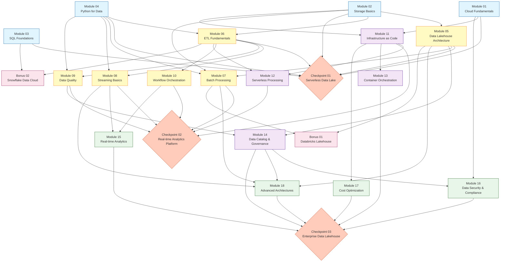

# 🗺️ Cloud Data Engineering - Learning Path

## Overview

This learning path guides you through mastering Cloud Data Engineering with AWS, organized into **18 core modules**, **3 integration checkpoints**, and **2 optional bonus modules**. The path is designed for self-paced learning with clear prerequisites and validation at each step.

## 📊 Learning Path Diagram



## 🎯 Learning Tiers

### Foundation Tier (Modules 01-04)
**No Prerequisites** - Start here!

These modules have no dependencies and can be completed in any order, though the suggested sequence is optimal:

| Module | Name | Focus | Time |
|--------|------|-------|------|
| 01 | Cloud Fundamentals | AWS basics, IAM, core services | 8-12h |
| 02 | Storage Basics | S3, data formats, object storage | 10-15h |
| 03 | SQL Foundations | Analytical SQL, window functions | 12-16h |
| 04 | Python for Data | Pandas, data manipulation, I/O | 10-14h |

**After completing all 4:** You're ready for Modules 05-06 and Checkpoint 01

---

### Core Tier (Modules 05-10)
**Prerequisites Required** - Build your data engineering skills

| Module | Name | Prerequisites | Focus |
|--------|------|---------------|-------|
| 05 | Data Lakehouse Architecture | 02 | Delta Lake, Iceberg, lakehouse patterns |
| 06 | ETL Fundamentals | 02, 04 | Pipeline design, transformations |
| **CP01** | **Serverless Data Lake** | **01-06** | **Integration checkpoint** |
| 07 | Batch Processing | 02, 04, 05 | Spark, distributed processing |
| 08 | Streaming Basics | 04, 06 | Kafka, real-time ingestion |
| 09 | Data Quality | 04, 06 | Validation, Great Expectations |
| 10 | Workflow Orchestration | 06 | Airflow, DAGs, scheduling |

---

### Cloud-Native Tier (Modules 11-14)
**Build cloud-native architectures**

| Module | Name | Prerequisites | Focus |
|--------|------|---------------|-------|
| 11 | Infrastructure as Code | 01, 02 | Terraform, CloudFormation |
| 12 | Serverless Processing | 06, 11 | Lambda, Step Functions |
| **CP02** | **Real-time Analytics Platform** | **07-12** | **Streaming checkpoint** |
| 13 | Container Orchestration | 11 | Docker, ECS, Kubernetes basics |
| 14 | Data Catalog & Governance | 05, 09 | Glue Catalog, metadata management |

---

### Advanced Tier (Modules 15-18)
**Master advanced concepts**

| Module | Name | Prerequisites | Parallel Track | Focus |
|--------|------|---------------|----------------|-------|
| 15 | Real-time Analytics | 08, 10 | Track A | Kinesis Analytics, Flink |
| 16 | Data Security & Compliance | 01, 14 | Track B | Encryption, GDPR, access control |
| 17 | Cost Optimization | 11 | Track C | FinOps, query optimization |
| 18 | Advanced Architectures | 05, 07, 08, 14 | - | Medallion, CDC, data mesh |
| **CP03** | **Enterprise Data Lakehouse** | **13-18** | - | **Final integration project** |

**Note:** Modules 15, 16, and 17 are **parallel tracks** - they have no mutual dependencies and can be completed in any order or simultaneously.

---

### Bonus Tier (Optional)
**Expand to other platforms**

| Module | Name | Prerequisites | Platform | Free Option |
|--------|------|---------------|----------|-------------|
| B01 | Databricks Lakehouse | 05, 07 | Databricks | Community Edition |
| B02 | Snowflake Data Cloud | 03, 06 | Snowflake | 30-day trial |

⚠️ **Cost Alert:** Bonus modules use cloud-managed platforms with free tiers. Review `COST-ALERT.md` in each module.

---

## 📋 How to Use This Learning Path

### 1. Start with Your Level

- **Complete Beginner?** → Start at Module 01
- **Some AWS experience?** → Start at Module 01, move faster through basics
- **Know AWS but new to data?** → Start at Module 05 after reviewing 01-04
- **Experienced data engineer?** → Review prerequisites, jump to advanced modules

### 2. Follow Prerequisites Strictly

**🔒 Blocked:** You cannot start a module until ALL prerequisites are 100% complete.

**🔓 Ready:** When all prerequisites are done, the module is unlocked.

Check prerequisites anytime:
```bash
python scripts/check-prerequisites.py module-XX-name
```

### 3. Complete Each Module 100%

A module is complete when:
- ✅ All theory documentation read
- ✅ All 6 exercises completed
- ✅ All validation tests passing
- ✅ Self-assessment checklist done

### 4. Track Your Progress

```bash
make progress
# or
python scripts/progress.py
```

### 5. Tackle Checkpoints as Integration Practice

Checkpoints are **project-based assessments** that combine multiple modules. They:
- Have stricter prerequisites (must complete several modules)
- Take longer (10-20 hours)
- Include acceptance tests with clear pass/fail criteria
- Prepare you for real-world scenarios
- Include certification practice questions

---

## 🛤️ Suggested Learning Paths

### Path 1: Batch-First (Traditional)
Best if you're coming from traditional data warehousing:

```
Foundation (01-04) → Lakehouse (05) → ETL (06) → CP01 →
Batch (07) → Orchestration (10) → IaC (11) → CP02 →
...continue sequentially
```

### Path 2: Streaming-First (Modern)
Best if you're interested in real-time:

```
Foundation (01-04) → Lakehouse (05) → ETL (06) → Streaming (08) →
Data Quality (09) → CP01 → ...continue with streaming focus
```

### Path 3: Cloud-Native First
Best if you have strong AWS background:

```
Foundation (01-04) → IaC (11) → Storage (02) → ETL (06) →
Serverless (12) → ...integrate data skills
```

### Path 4: Certification-Focused
Optimized for AWS Data Analytics - Specialty cert:

```
Follow sequential path 01-18, focus on:
- Security (16)
- Governance (14)
- Cost (17)
Complete all checkpoints for practice questions
```

---

## ⏱️ Time Estimates

### By Tier

- **Foundation (01-04):** 40-57 hours
- **Core (05-10 + CP01):** 70-100 hours
- **Cloud-Native (11-14 + CP02):** 50-70 hours
- **Advanced (15-18 + CP03):** 60-85 hours
- **Bonus (optional):** 30-40 hours

### Total

- **Core Path (01-18 + 3 checkpoints):** 220-312 hours
- **With Bonus Modules:** 250-352 hours

### Pace Options

- **Intensive:** 20 hours/week = 11-16 weeks
- **Part-time:** 10 hours/week = 22-32 weeks
- **Casual:** 5 hours/week = 44-63 weeks

---

## 🎓 Certification Mapping

### AWS Certified Data Analytics - Specialty

| Exam Domain | Relevant Modules |
|-------------|------------------|
| Collection (18%) | 02, 06, 08 |
| Storage & Management (22%) | 02, 05, 14 |
| Processing (24%) | 07, 08, 12 |
| Analysis & Visualization (18%) | 03, 15 |
| Security (18%) | 01, 16 |

**Recommended:** Complete modules 01-14 + CP02 before attempting exam.

### Databricks Data Engineer Associate

| Exam Area | Relevant Modules |
|-----------|------------------|
| Delta Lake | 05, B01 |
| ELT with Spark | 07, B01 |
| Orchestration | 10, B01 |

**Recommended:** Complete core path + Bonus 01.

---

## 📊 Progress Tracking

Your progress is automatically tracked based on:

1. **Exercises Completed:** Files in `my_solution/` directories
2. **Validation Tests:** Passing tests in `validation/`
3. **Prerequisites:** Automatically calculated dependencies

View progress anytime:
```bash
make progress
```

Example output:
```
✅ 🔓 Module 01: Cloud Fundamentals                100%
✅ 🔓 Module 02: Storage Basics                    100%
🔄 🔓 Module 03: SQL Foundations                    67%
⬜ 🔒 Module 05: Data Lakehouse Architecture         0%  (requires 02)
```

---

## 💡 Learning Tips

### 1. Don't Skip Prerequisites
They're designed for a reason. Missing foundational concepts makes advanced modules frustrating.

### 2. Use the Validation System
Run `bash scripts/validate.sh` frequently. It's not just grading - it teaches you what's important.

### 3. Read "Expected Approach" First
Each exercise has an "Expected Approach" section. Read it before implementing to avoid wrong paths.

### 4. Leverage Hints Progressively
Stuck? Check `hints.md` - they're designed to unblock you without spoiling the solution.

### 5. Treat Checkpoints Seriously
They're your confidence builders. If you can pass checkpoints, you can handle production scenarios.

### 6. Use LocalStack Effectively
You're learning AWS without AWS costs. Occasionally reference real AWS docs to understand differences.

### 7. Join the Community
(Link to Discord/Slack if available) - discuss challenges, share solutions, learn together.

---

## 🆘 Getting Help

### Module-Specific Issues

1. Review `theory/concepts.md` - often contains answers
2. Check `theory/resources.md` for video tutorials
3. Look at `hints.md` in the exercise
4. Compare your approach with `solution/` (only after trying!)

### Technical Issues

- Docker not starting? → `docs/troubleshooting.md`
- LocalStack errors? → `docs/localstack-guide.md`
- Validation failures? → Read the test output carefully
- Environment setup? → `docs/setup-guide.md`

### General Questions

- Check `README.md` in project root
- Review `LEARNING-PATH.md` (this document)
- Search in `docs/` directory

---

## 🎯 Success Criteria

You've successfully completed the Cloud Data Engineering learning path when:

- ✅ All 18 core modules at 100%
- ✅ All 3 checkpoints passing
- ✅ Can explain architectures and trade-offs
- ✅ Comfortable building end-to-end data pipelines
- ✅ Ready for production data engineering roles

**Bonus Achievement:**
- ✅ Passed AWS Data Analytics - Specialty
- ✅ Passed Databricks Data Engineer Associate
- ✅ Completed bonus modules

---

## 📚 Additional Resources

- **Setup Guide:** `docs/setup-guide.md`
- **LocalStack Guide:** `docs/localstack-guide.md`
- **Troubleshooting:** `docs/troubleshooting.md`
- **Video Curations:** `docs/video-guide.md`
- **Certification Prep:** `docs/certifications/`

---

## 🚀 Ready to Start?

1. **Setup your environment:**
   ```bash
   bash scripts/setup-environment.sh
   ```

2. **Start services:**
   ```bash
   make up
   ```

3. **Begin Module 01:**
   ```bash
   cd modules/module-01-cloud-fundamentals
   cat README.md
   ```

**Good luck on your Cloud Data Engineering journey! 🎓**
