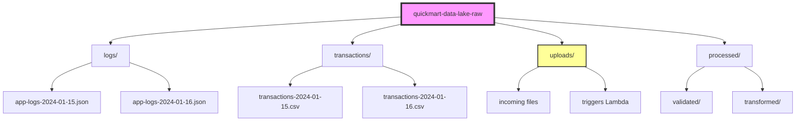
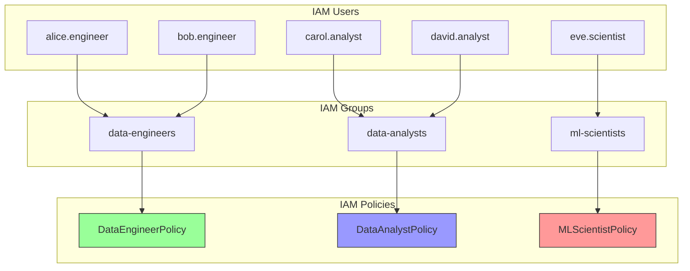
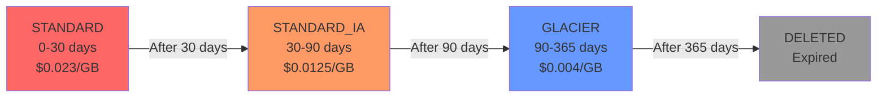
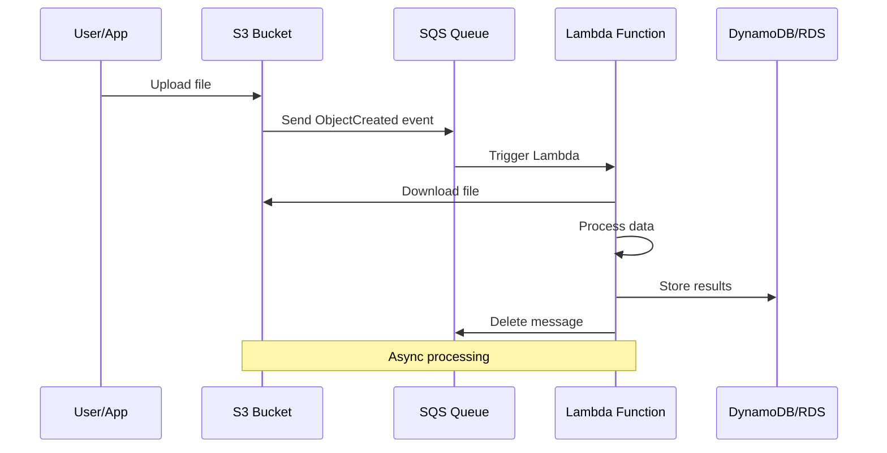
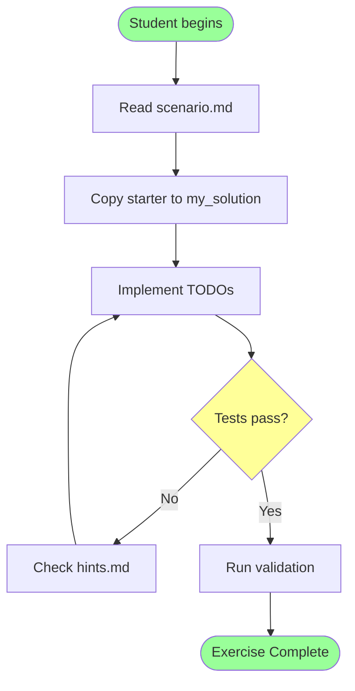
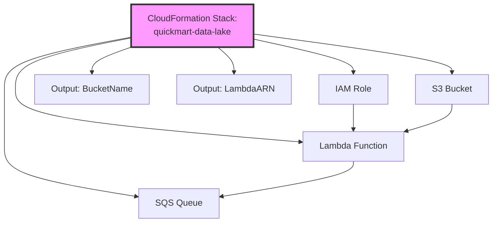
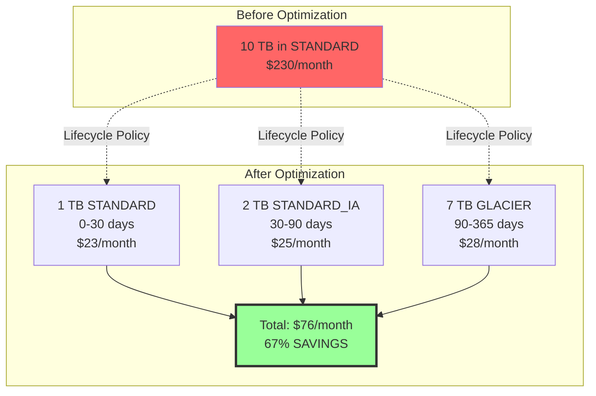
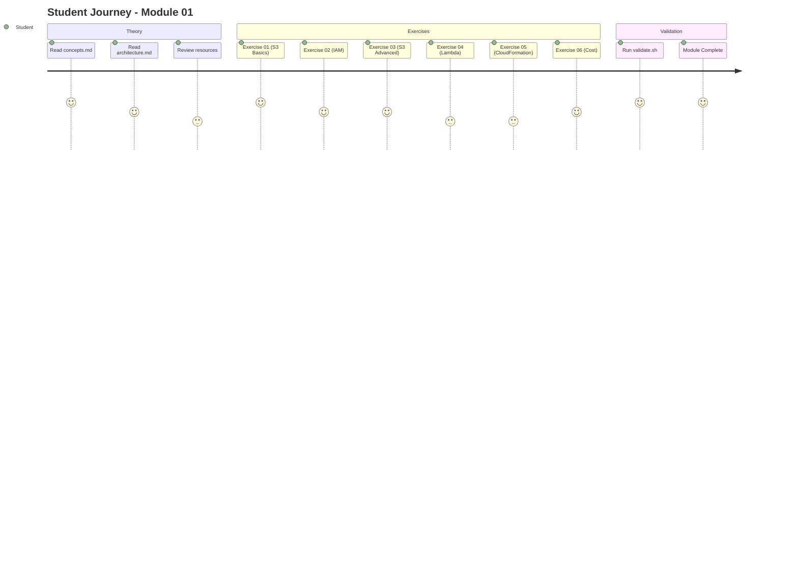

# Module 01: Cloud Fundamentals - Architecture Diagrams

## S3 Bucket Structure

## IAM Hierarchy

## S3 Lifecycle Transitions

## Event-Driven Architecture

## Data Flow - Exercise 01

## CloudFormation Stack Resources

## Cost Optimization Strategy

## Module 01 Learning Path

---

## Usage

These diagrams are rendered automatically in GitHub/GitLab Markdown viewers.

To render locally:
- Use VSCode with Markdown Preview Mermaid Support extension
- Use [Mermaid Live Editor](https://mermaid.live/)
- Export as PNG/SVG for documentation
