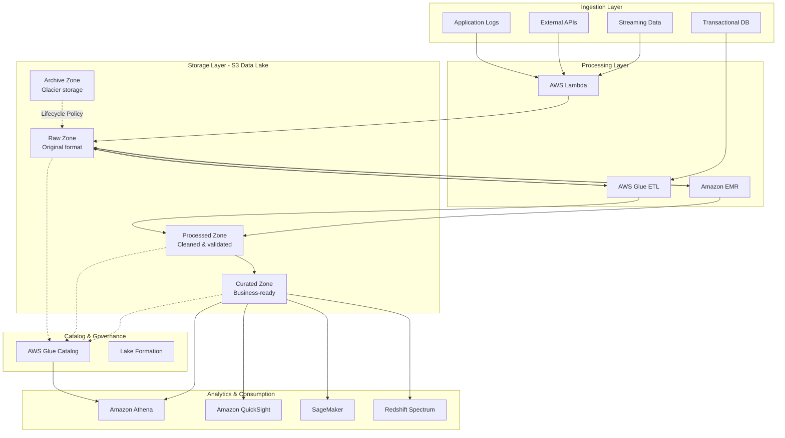
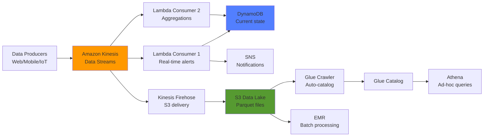
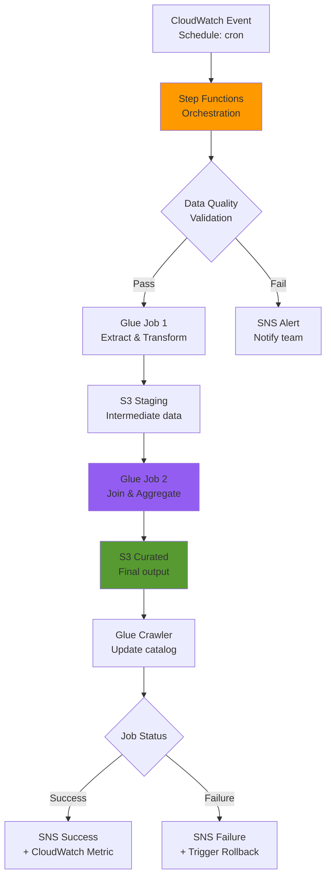
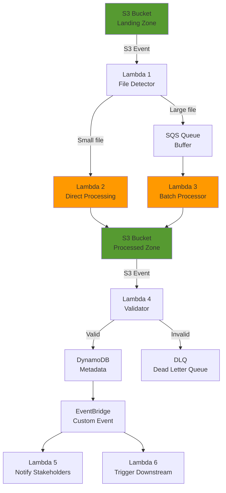
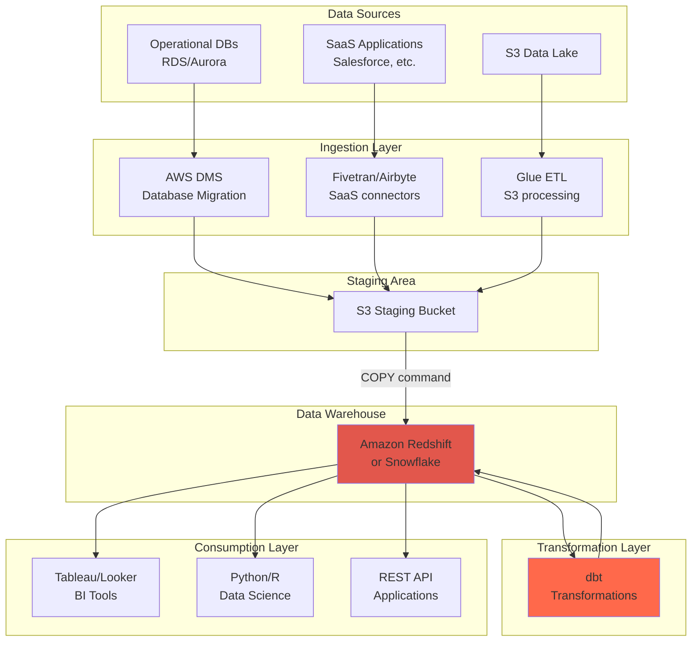
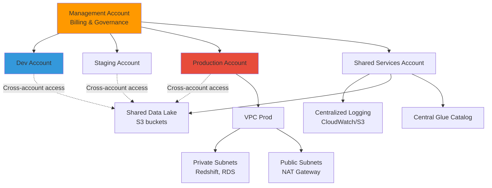
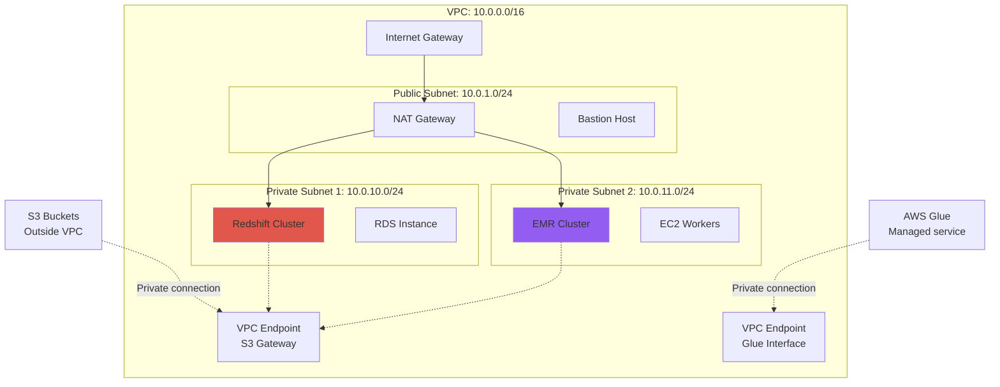
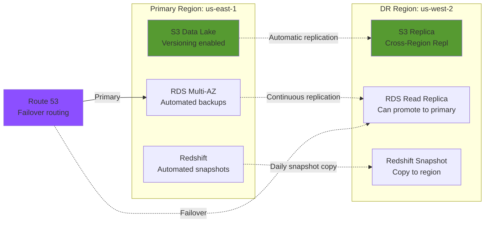
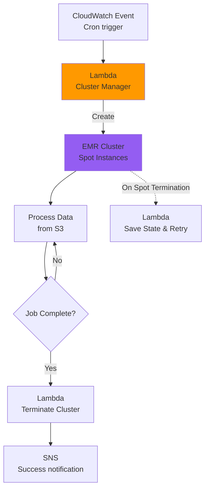
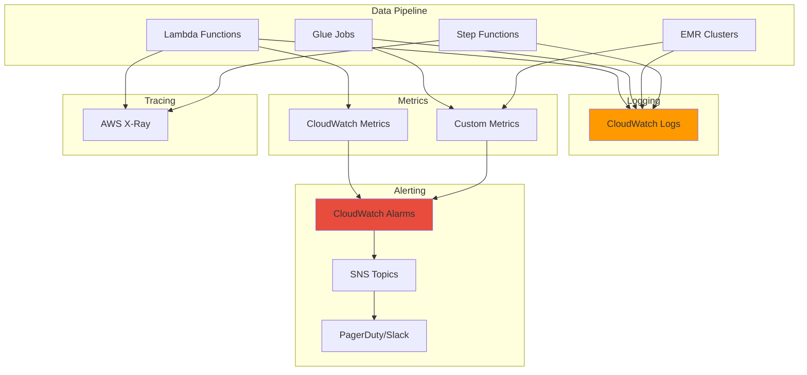

# Arquitecturas de Referencia AWS para Data Engineering

**Objetivo:** Comprender patrones arquitectónicos comunes y cómo diseñar sistemas cloud-native para datos.

---

## 1. Arquitectura de Data Lake en AWS

### Diagrama Conceptual



### Zonas del Data Lake

**Raw Zone (Bronze Layer)**
```
Propósito: Almacenar datos en su formato original e inmutable
Formato: Como llegaron (CSV, JSON, XML, Avro, binary)
Particionamiento: Por fecha de ingestion
Retención: 30-90 días (luego a Archive)

Ejemplo path:
s3://company-datalake-raw/source=salesforce/year=2024/month=01/day=15/
```

**Processed Zone (Silver Layer)**
```
Propósito: Datos limpiados, validados y transformados
Formato: Parquet o ORC (columnar, comprimido)
Particionamiento: Por columnas de negocio (fecha, región, etc.)
Retención: 1-2 años en Standard, luego Standard-IA

Ejemplo path:
s3://company-datalake-processed/domain=sales/dataset=transactions/
year=2024/month=01/day=15/
```

**Curated Zone (Gold Layer)**
```
Propósito: Datasets listos para análisis y reporting
Formato: Parquet optimizado (sorted, bucketed)
Particionamiento: Optimizado para queries comunes
Retención: Indefinida (con lifecycle a IA después de 6 meses)

Ejemplo path:
s3://company-datalake-curated/business_domain=finance/
dataset=revenue_daily_summary/year=2024/month=01/
```

**Archive Zone**
```
Propósito: Compliance y long-term retention
Storage Class: S3 Glacier o Glacier Deep Archive
Retención: 7-10 años
Costo: $0.00099/GB/mes (vs. $0.023 Standard)

Restore time:
- Glacier: 1-5 minutos (Expedited) a 12 horas (Bulk)
- Deep Archive: 12-48 horas
```

---

## 2. Arquitectura de Streaming Real-Time

### Diagrama de Flujo



### Componentes y Responsabilidades

**Kinesis Data Streams**
```
Capacidad: 1MB/sec write, 2MB/sec read per shard
Retención: 24 horas (default) - 7 días (extended)
Escalado: Manual (add/remove shards) o On-Demand (automático)

Cálculo de shards necesarios:
Incoming data: 10MB/sec
Shards needed: 10MB / 1MB = 10 shards

Costo: $0.015 per shard-hour = ~$11/mes per shard
```

**Lambda como Consumer**
```python
# Lambda triggered por Kinesis
def lambda_handler(event, context):
    for record in event['Records']:
        # Kinesis data en base64
        payload = base64.b64decode(record['kinesis']['data'])
        
        # Procesar evento
        process_event(json.loads(payload))
    
    # Batch processing: hasta 10,000 records por invocación
    return {'statusCode': 200, 'processed': len(event['Records'])}
```

**Kinesis Firehose (Delivery)**
```
Ventajas:
- Entrega automática a S3 cada X minutos o Y MB
- Puede transformar datos en ruta (Lambda)
- Convierte a Parquet automáticamente
- Comprime con Gzip/Snappy
- Sin gestión de shards

Configuración típica:
- Buffer: 5 minutos o 5MB (lo que ocurra primero)
- Formato: JSON → Parquet
- Compresión: Snappy
- Destino: s3://datalake/streaming/year=!{timestamp:yyyy}/...
```

**DynamoDB para State**
```
Uso: Almacenar estado actual para queries rápidas

Ejemplo - Dashboard en tiempo real:
Table: current_metrics
Partition Key: metric_name (ej: "total_revenue_today")
Attributes: value, timestamp, metadata

Query latency: Single-digit milliseconds
Costo: On-Demand pricing (solo pagas por requests)
```

---

## 3. Arquitectura Batch ETL con Orquestación



### Step Functions State Machine (Simplified)

```json
{
  "Comment": "Daily ETL Pipeline",
  "StartAt": "ValidateSourceData",
  "States": {
    "ValidateSourceData": {
      "Type": "Task",
      "Resource": "arn:aws:lambda:us-east-1:123456789012:function:validate-data",
      "Next": "CheckValidation",
      "Catch": [{
        "ErrorEquals": ["States.ALL"],
        "Next": "NotifyFailure"
      }]
    },
    "CheckValidation": {
      "Type": "Choice",
      "Choices": [{
        "Variable": "$.validation.status",
        "StringEquals": "PASS",
        "Next": "RunGlueETL"
      }],
      "Default": "NotifyFailure"
    },
    "RunGlueETL": {
      "Type": "Task",
      "Resource": "arn:aws:states:::glue:startJobRun.sync",
      "Parameters": {
        "JobName": "daily-etl-job",
        "Arguments": {
          "--execution_date.$": "$.execution_date"
        }
      },
      "Next": "AggregateResults",
      "Catch": [{
        "ErrorEquals": ["States.ALL"],
        "Next": "NotifyFailure"
      }]
    },
    "AggregateResults": {
      "Type": "Task",
      "Resource": "arn:aws:states:::glue:startJobRun.sync",
      "Parameters": {
        "JobName": "aggregate-job"
      },
      "Next": "UpdateCatalog"
    },
    "UpdateCatalog": {
      "Type": "Task",
      "Resource": "arn:aws:states:::glue:startCrawler",
      "Parameters": {
        "Name": "curated-data-crawler"
      },
      "Next": "NotifySuccess"
    },
    "NotifySuccess": {
      "Type": "Task",
      "Resource": "arn:aws:states:::sns:publish",
      "Parameters": {
        "TopicArn": "arn:aws:sns:us-east-1:123456789012:etl-success",
        "Message": "ETL pipeline completed successfully"
      },
      "End": true
    },
    "NotifyFailure": {
      "Type": "Task",
      "Resource": "arn:aws:states:::sns:publish",
      "Parameters": {
        "TopicArn": "arn:aws:sns:us-east-1:123456789012:etl-failure",
        "Message": "ETL pipeline failed"
      },
      "End": true
    }
  }
}
```

### Scheduling con CloudWatch Events

```python
# Terraform para programar Step Functions
resource "aws_cloudwatch_event_rule" "daily_etl" {
  name                = "daily-etl-trigger"
  description         = "Trigger ETL pipeline daily at 2 AM UTC"
  schedule_expression = "cron(0 2 * * ? *)"
}

resource "aws_cloudwatch_event_target" "step_functions" {
  rule      = aws_cloudwatch_event_rule.daily_etl.name
  target_id = "TriggerStepFunction"
  arn       = aws_sfn_state_machine.etl_pipeline.arn
  role_arn  = aws_iam_role.eventbridge_sfn_role.arn
  
  input = jsonencode({
    execution_date = "{{ timestamp }}"
    environment    = "production"
  })
}
```

---

## 4. Arquitectura Lambda-Driven Serverless ETL



### Patrón: File Processing Pipeline

**Lambda 1: File Detector**
```python
import boto3
import json

s3 = boto3.client('s3')
sqs = boto3.client('sqs')

def lambda_handler(event, context):
    """Detecta archivos nuevos y rutea según tamaño"""
    
    for record in event['Records']:
        bucket = record['s3']['bucket']['name']
        key = record['s3']['object']['key']
        size = record['s3']['object']['size']
        
        # Small files: Procesar directamente
        if size < 10 * 1024 * 1024:  # < 10MB
            process_small_file(bucket, key)
        
        # Large files: Queue para procesamiento batch
        else:
            sqs.send_message(
                QueueUrl=os.environ['BATCH_QUEUE_URL'],
                MessageBody=json.dumps({
                    'bucket': bucket,
                    'key': key,
                    'size': size
                })
            )
    
    return {'statusCode': 200}
```

**Lambda 2: Direct Processor (Small Files)**
```python
import pandas as pd
from io import StringIO

def process_small_file(bucket, key):
    """Procesa archivos pequeños en memoria"""
    
    # Leer archivo
    obj = s3.get_object(Bucket=bucket, Key=key)
    df = pd.read_csv(StringIO(obj['Body'].read().decode('utf-8')))
    
    # Transformar
    df_transformed = transform_data(df)
    
    # Escribir a Parquet
    output_key = key.replace('.csv', '.parquet')
    df_transformed.to_parquet(
        f's3://{OUTPUT_BUCKET}/{output_key}',
        compression='snappy'
    )
```

**Lambda 3: Batch Processor (Large Files)**
```python
def lambda_handler(event, context):
    """Procesa archivos grandes por chunks"""
    
    for record in event['Records']:
        message = json.loads(record['body'])
        bucket = message['bucket']
        key = message['key']
        
        # Procesar por chunks para evitar memory issues
        process_in_chunks(bucket, key, chunk_size=100000)
```

### Consideraciones de Diseño

**Límites de Lambda:**
```
Memory: 128MB - 10GB
Timeout: Máximo 15 minutos
/tmp storage: 512MB (ephemeral)
Concurrent executions: 1000 (default limit)

Reglas de oro:
- Archivos <10MB: Direct processing
- Archivos 10MB-100MB: Chunk processing
- Archivos >100MB: Usar Glue o EMR
```

**Dead Letter Queues (DLQ):**
```
Propósito: Capturar mensajes/archivos que fallan procesamiento

Configuración:
Lambda → On failure → Send to DLQ (SQS or SNS)

Monitoring:
CloudWatch Alarm: DLQ message count > 0 → Alert team
```

---

## 5. Arquitectura de Data Warehouse Moderno



### Redshift Architecture Deep Dive

**Cluster Structure:**
```
Leader Node:
- Recibe queries de clientes
- Parsea y optimiza queries
- Distribuye trabajo a compute nodes
- Agrega resultados finales

Compute Nodes:
- Ejecutan queries en paralelo
- Almacenan datos en slices (particiones)
- Comunicación entre nodos para joins

Example cluster:
- dc2.large: 2 vCPUs, 15GB RAM, 160GB SSD
- 4 nodes = 8 vCPUs, 60GB RAM, 640GB storage
- Cost: ~$250/mes On-Demand
```

**Distribution Styles:**
```sql
-- EVEN: Distribución round-robin (default)
CREATE TABLE logs (
    id INT,
    message VARCHAR(500)
) DISTSTYLE EVEN;

-- KEY: Distribución por columna específica
-- Usa para joins frecuentes
CREATE TABLE orders (
    order_id INT,
    customer_id INT,
    amount DECIMAL
) DISTKEY(customer_id);

-- ALL: Replica tabla en todos los nodos
-- Usa para dimension tables pequeñas
CREATE TABLE dim_products (
    product_id INT,
    product_name VARCHAR(100)
) DISTSTYLE ALL;
```

**Sort Keys:**
```sql
-- Sort key mejora queries con WHERE y ORDER BY
CREATE TABLE sales (
    sale_id INT,
    sale_date DATE,
    customer_id INT,
    amount DECIMAL
) SORTKEY(sale_date);

-- Compound sort key: múltiples columnas en orden
SORTKEY(sale_date, customer_id)

-- Interleaved sort key: igual peso a todas las columnas
INTERLEAVED SORTKEY(sale_date, customer_id, region)
```

**COPY Command (Bulk Load):**
```sql
-- Forma más eficiente de cargar datos a Redshift
COPY sales
FROM 's3://my-bucket/data/sales/year=2024/month=01/'
IAM_ROLE 'arn:aws:iam::123456789012:role/RedshiftCopyRole'
FORMAT AS PARQUET;

-- Beneficios:
-- - Paralelo automático (todos los compute nodes participan)
-- - Compresión automática
-- - Load de 1TB puede tomar <30 minutos
```

---

## 6. Arquitectura Multi-Account con AWS Organizations



### Cross-Account S3 Access Pattern

**Shared Services Account (S3 Bucket Policy):**
```json
{
  "Version": "2012-10-17",
  "Statement": [
    {
      "Sid": "AllowDevAccountRead",
      "Effect": "Allow",
      "Principal": {
        "AWS": "arn:aws:iam::111111111111:root"
      },
      "Action": [
        "s3:GetObject",
        "s3:ListBucket"
      ],
      "Resource": [
        "arn:aws:s3:::shared-data-lake",
        "arn:aws:s3:::shared-data-lake/*"
      ]
    },
    {
      "Sid": "AllowProdAccountFullAccess",
      "Effect": "Allow",
      "Principal": {
        "AWS": "arn:aws:iam::333333333333:root"
      },
      "Action": "s3:*",
      "Resource": [
        "arn:aws:s3:::shared-data-lake",
        "arn:aws:s3:::shared-data-lake/*"
      ]
    }
  ]
}
```

**Dev Account (IAM Role):**
```json
{
  "Version": "2012-10-17",
  "Statement": [
    {
      "Effect": "Allow",
      "Action": [
        "s3:GetObject",
        "s3:ListBucket"
      ],
      "Resource": [
        "arn:aws:s3:::shared-data-lake",
        "arn:aws:s3:::shared-data-lake/*"
      ]
    }
  ]
}
```

### Ventajas Multi-Account

**Seguridad:**
```
- Blast radius limitado (breach en Dev no afecta Prod)
- IAM policies más simples (menos condiciones complejas)
- Compliance: separación de ambientes regulada
```

**Billing:**
```
- Cost allocation por cuenta
- Budgets y alertas específicas por ambiente
- Reserved Instances compartidas vía Organizations
```

**Governance:**
```
- Service Control Policies (SCPs) a nivel Organization
- Prevent actions no permitidas (ej: "No puedes deshabilitar CloudTrail")
- Enforce tagging standards
```

---

## 7. Networking para Data Engineering



### VPC Endpoints para Data Services

**S3 Gateway Endpoint (FREE):**
```hcl
resource "aws_vpc_endpoint" "s3" {
  vpc_id       = aws_vpc.main.id
  service_name = "com.amazonaws.us-east-1.s3"
  
  route_table_ids = [
    aws_route_table.private_subnet_1.id,
    aws_route_table.private_subnet_2.id
  ]
}

# Ventajas:
# - Tráfico S3 no sale a Internet (más seguro)
# - Sin cargos de NAT Gateway para tráfico S3
# - Menor latencia
```

**Glue Interface Endpoint:**
```hcl
resource "aws_vpc_endpoint" "glue" {
  vpc_id              = aws_vpc.main.id
  service_name        = "com.amazonaws.us-east-1.glue"
  vpc_endpoint_type   = "Interface"
  subnet_ids          = [aws_subnet.private_1.id]
  security_group_ids  = [aws_security_group.glue_endpoint.id]
  
  private_dns_enabled = true
}

# Costo: $0.01/hora + $0.01/GB transferido = ~$7/mes + data transfer
# Beneficio: Glue jobs en VPC pueden acceder a Glue API sin Internet
```

### Security Groups para Data Services

**Redshift Security Group:**
```hcl
resource "aws_security_group" "redshift" {
  name_prefix = "redshift-"
  vpc_id      = aws_vpc.main.id
  
  # Permitir acceso desde EMR
  ingress {
    from_port       = 5439
    to_port         = 5439
    protocol        = "tcp"
    security_groups = [aws_security_group.emr_master.id]
  }
  
  # Permitir acceso desde bastion
  ingress {
    from_port       = 5439
    to_port         = 5439
    protocol        = "tcp"
    security_groups = [aws_security_group.bastion.id]
  }
  
  # Outbound a S3 endpoint
  egress {
    from_port   = 443
    to_port     = 443
    protocol    = "tcp"
    cidr_blocks = [aws_vpc.main.cidr_block]
  }
}
```

---

## 8. Disaster Recovery (DR) Architecture



### Recovery Time Objective (RTO) vs Recovery Point Objective (RPO)

**RTO:** Tiempo para recuperar servicio después de desastre  
**RPO:** Cantidad de datos que puedes perder (tiempo desde último backup)

**Estrategias por Servicio:**

**S3 (Data Lake):**
```
Estrategia: Cross-Region Replication (CRR)
RPO: Minutos (replicación asíncrona pero rápida)
RTO: Minutos (solo actualizar endpoints)
Costo: Storage duplicado + replication fees

Configuración:
aws s3api put-bucket-replication \
  --bucket source-bucket \
  --replication-configuration '{
    "Role": "arn:aws:iam::123:role/ReplicationRole",
    "Rules": [{
      "Status": "Enabled",
      "Priority": 1,
      "Filter": {},
      "Destination": {
        "Bucket": "arn:aws:s3:::destination-bucket",
        "ReplicationTime": {"Status": "Enabled", "Time": {"Minutes": 15}}
      }
    }]
  }'
```

**RDS (Metadata Stores):**
```
Estrategia: Cross-Region Read Replica
RPO: Segundos (replicación binlog continua)
RTO: Minutos (promote replica to standalone)
Costo: Adicional instance + data transfer

Failover:
aws rds promote-read-replica \
  --db-instance-identifier mydb-replica-us-west-2
```

**Redshift (Data Warehouse):**
```
Estrategia: Automated snapshot copy to DR region
RPO: Horas (depende de snapshot schedule)
RTO: Horas (restore desde snapshot)
Costo: Snapshot storage en DR region

Configuración:
aws redshift enable-snapshot-copy \
  --cluster-identifier my-cluster \
  --destination-region us-west-2 \
  --retention-period 7
```

---

## 9. Cost-Optimized Architecture

### Arquitectura para Workloads Batch Intermitentes



**Cluster Manager Lambda:**
```python
import boto3

emr = boto3.client('emr')

def lambda_handler(event, context):
    """Launch ephemeral EMR cluster with Spot instances"""
    
    response = emr.run_job_flow(
        Name='nightly-etl-cluster',
        ReleaseLabel='emr-6.10.0',
        Instances={
            'InstanceGroups': [
                {
                    'Name': 'Master',
                    'Market': 'ON_DEMAND',  # Master: Always On-Demand
                    'InstanceRole': 'MASTER',
                    'InstanceType': 'm5.xlarge',
                    'InstanceCount': 1
                },
                {
                    'Name': 'Core',
                    'Market': 'SPOT',  # Core: Spot with fallback
                    'InstanceRole': 'CORE',
                    'InstanceType': 'm5.xlarge',
                    'InstanceCount': 2,
                    'BidPrice': '0.10',  # ~60% discount
                    'EbsConfiguration': {
                        'EbsOptimized': True,
                        'EbsBlockDeviceConfigs': [{
                            'VolumeSpecification': {
                                'VolumeType': 'gp3',
                                'SizeInGB': 100
                            },
                            'VolumesPerInstance': 1
                        }]
                    }
                }
            ],
            'KeepJobFlowAliveWhenNoSteps': False,  # Auto-terminate
            'TerminationProtected': False
        },
        Steps=[{
            'Name': 'Run PySpark ETL',
            'ActionOnFailure': 'TERMINATE_CLUSTER',
            'HadoopJarStep': {
                'Jar': 'command-runner.jar',
                'Args': [
                    'spark-submit',
                    '--deploy-mode', 'cluster',
                    's3://my-bucket/scripts/etl_job.py',
                    '--input', 's3://my-bucket/input/',
                    '--output', 's3://my-bucket/output/'
                ]
            }
        }],
        BootstrapActions=[{
            'Name': 'Install dependencies',
            'ScriptBootstrapAction': {
                'Path': 's3://my-bucket/bootstrap/install_deps.sh'
            }
        }],
        Applications=[
            {'Name': 'Spark'},
            {'Name': 'Hadoop'}
        ],
        JobFlowRole='EMR_EC2_DefaultRole',
        ServiceRole='EMR_DefaultRole',
        LogUri='s3://my-bucket/emr-logs/',
        Tags=[
            {'Key': 'Environment', 'Value': 'Production'},
            {'Key': 'CostCenter', 'Value': 'DataEngineering'}
        ]
    )
    
    return {'cluster_id': response['JobFlowId']}
```

**Cálculo de Ahorro:**
```
Escenario: Proceso nocturno que toma 2 horas/día

Opción A: EMR Cluster 24/7
- 3 × m5.xlarge × $0.192/hr × 24 × 30 = $414/mes

Opción B: Cluster ephemeral On-Demand
- 3 × m5.xlarge × $0.192/hr × 2 × 30 = $34.56/mes
- Ahorro: 92%

Opción C: Cluster ephemeral con Spot (2 Core Spot)
- Master On-Demand: 1 × $0.192 × 2 × 30 = $11.52
- Core Spot: 2 × $0.077 × 2 × 30 = $9.24
- Total: $20.76/mes
- Ahorro: 95%
```

---

## 10. Observability Architecture



### CloudWatch Custom Metrics para Pipelines

```python
import boto3
from datetime import datetime

cloudwatch = boto3.client('cloudwatch')

def publish_pipeline_metrics(
    pipeline_name: str,
    records_processed: int,
    execution_time_ms: int,
    errors: int
):
    """Publicar métricas custom de pipeline a CloudWatch"""
    
    cloudwatch.put_metric_data(
        Namespace='DataEngineering/Pipelines',
        MetricData=[
            {
                'MetricName': 'RecordsProcessed',
                'Value': records_processed,
                'Unit': 'Count',
                'Timestamp': datetime.utcnow(),
                'Dimensions': [
                    {'Name': 'PipelineName', 'Value': pipeline_name}
                ]
            },
            {
                'MetricName': 'ExecutionTime',
                'Value': execution_time_ms,
                'Unit': 'Milliseconds',
                'Dimensions': [
                    {'Name': 'PipelineName', 'Value': pipeline_name}
                ]
            },
            {
                'MetricName': 'ErrorCount',
                'Value': errors,
                'Unit': 'Count',
                'Dimensions': [
                    {'Name': 'PipelineName', 'Value': pipeline_name}
                ]
            },
            {
                'MetricName': 'Throughput',
                'Value': records_processed / (execution_time_ms / 1000),
                'Unit': 'Count/Second',
                'Dimensions': [
                    {'Name': 'PipelineName', 'Value': pipeline_name}
                ]
            }
        ]
    )

# Uso en pipeline
start_time = time.time()
records = process_data()
execution_time = (time.time() - start_time) * 1000

publish_pipeline_metrics(
    pipeline_name='daily-etl',
    records_processed=len(records),
    execution_time_ms=execution_time,
    errors=error_count
)
```

### CloudWatch Alarms para SLAs

```python
# Terraform: Alarma si tasa de errores >1%
resource "aws_cloudwatch_metric_alarm" "pipeline_error_rate" {
  alarm_name          = "high-error-rate-daily-etl"
  comparison_operator = "GreaterThanThreshold"
  evaluation_periods  = "2"
  threshold           = "1.0"
  alarm_description   = "Error rate exceeds 1%"
  
  metric_query {
    id          = "error_rate"
    expression  = "(errors / total) * 100"
    label       = "Error Rate"
    return_data = true
  }
  
  metric_query {
    id = "errors"
    metric {
      metric_name = "ErrorCount"
      namespace   = "DataEngineering/Pipelines"
      period      = "300"
      stat        = "Sum"
      dimensions = {
        PipelineName = "daily-etl"
      }
    }
  }
  
  metric_query {
    id = "total"
    metric {
      metric_name = "RecordsProcessed"
      namespace   = "DataEngineering/Pipelines"
      period      = "300"
      stat        = "Sum"
      dimensions = {
        PipelineName = "daily-etl"
      }
    }
  }
  
  alarm_actions = [aws_sns_topic.pipeline_alerts.arn]
}
```

---

## Próximos Pasos

Ahora que entiendes los patrones arquitectónicos:

1. **Revisa `resources.md`** para videos y documentación oficial
2. **Completa los ejercicios** aplicando estos patrones
3. **Dibuja tus propias arquitecturas** para casos de uso específicos
4. **Considera trade-offs** entre complejidad, costo y performance

**Recuerda:** No hay "una arquitectura perfecta". Todo depende de requisitos específicos de tu caso de uso.
