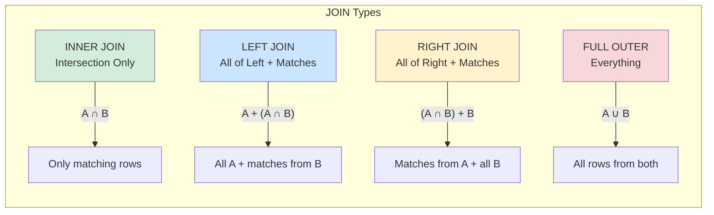

# JOIN Types Visual Guide

## INNER JOIN

```mermaid
graph LR
    subgraph "Table A (users)"
        A1[user_id: 1<br/>name: Alice]
        A2[user_id: 2<br/>name: Bob]
        A3[user_id: 3<br/>name: Charlie]
    end
    
    subgraph "Table B (orders)"
        B1[order_id: 101<br/>user_id: 1]
        B2[order_id: 102<br/>user_id: 2]
        B3[order_id: 103<br/>user_id: 4]
    end
    
    subgraph "Result: INNER JOIN"
        R1[Alice | order 101]
        R2[Bob | order 102]
    end
    
    A1 -.->|match| B1
    A2 -.->|match| B2
    A3 -.->|no match| X1[ ]
    B3 -.->|no match| X2[ ]
    
    B1 --> R1
    B2 --> R2
    
    style A3 fill:#ffcccc
    style B3 fill:#ffcccc
    style X1 fill:#fff,stroke:#fff
    style X2 fill:#fff,stroke:#fff
```

**Returns**: Only matching rows from both tables

```sql
SELECT u.name, o.order_id
FROM users u
INNER JOIN orders o ON u.user_id = o.user_id;
-- Result: Alice (101), Bob (102)
```

---

## LEFT JOIN

```mermaid
graph LR
    subgraph "Table A (users)"
        A1[user_id: 1<br/>name: Alice]
        A2[user_id: 2<br/>name: Bob]
        A3[user_id: 3<br/>name: Charlie]
    end
    
    subgraph "Table B (orders)"
        B1[order_id: 101<br/>user_id: 1]
        B2[order_id: 102<br/>user_id: 2]
        B3[order_id: 103<br/>user_id: 4]
    end
    
    subgraph "Result: LEFT JOIN"
        R1[Alice | order 101]
        R2[Bob | order 102]
        R3[Charlie | NULL]
    end
    
    A1 -.->|match| B1
    A2 -.->|match| B2
    A3 -.->|no match, keep| R3
    
    B1 --> R1
    B2 --> R2
    
    style A3 fill:#cce5ff
    style R3 fill:#e6f3ff
    style B3 fill:#ffcccc,stroke-dasharray: 5 5
```

**Returns**: All rows from left table + matching rows from right (NULL if no match)

```sql
SELECT u.name, o.order_id
FROM users u
LEFT JOIN orders o ON u.user_id = o.user_id;
-- Result: Alice (101), Bob (102), Charlie (NULL)
```

---

## RIGHT JOIN

```mermaid
graph LR
    subgraph "Table A (users)"
        A1[user_id: 1<br/>name: Alice]
        A2[user_id: 2<br/>name: Bob]
        A3[user_id: 3<br/>name: Charlie]
    end
    
    subgraph "Table B (orders)"
        B1[order_id: 101<br/>user_id: 1]
        B2[order_id: 102<br/>user_id: 2]
        B3[order_id: 103<br/>user_id: 4]
    end
    
    subgraph "Result: RIGHT JOIN"
        R1[Alice | order 101]
        R2[Bob | order 102]
        R3[NULL | order 103]
    end
    
    A1 -.->|match| B1
    A2 -.->|match| B2
    B3 -.->|no match, keep| R3
    
    B1 --> R1
    B2 --> R2
    
    style A3 fill:#ffcccc,stroke-dasharray: 5 5
    style B3 fill:#cce5ff
    style R3 fill:#e6f3ff
```

**Returns**: All rows from right table + matching rows from left (NULL if no match)

```sql
SELECT u.name, o.order_id
FROM users u
RIGHT JOIN orders o ON u.user_id = o.user_id;
-- Result: Alice (101), Bob (102), NULL (103)
```

---

## FULL OUTER JOIN

```mermaid
graph LR
    subgraph "Table A (users)"
        A1[user_id: 1<br/>name: Alice]
        A2[user_id: 2<br/>name: Bob]
        A3[user_id: 3<br/>name: Charlie]
    end
    
    subgraph "Table B (orders)"
        B1[order_id: 101<br/>user_id: 1]
        B2[order_id: 102<br/>user_id: 2]
        B3[order_id: 103<br/>user_id: 4]
    end
    
    subgraph "Result: FULL OUTER JOIN"
        R1[Alice | order 101]
        R2[Bob | order 102]
        R3[Charlie | NULL]
        R4[NULL | order 103]
    end
    
    A1 -.->|match| B1
    A2 -.->|match| B2
    A3 -.->|keep| R3
    B3 -.->|keep| R4
    
    B1 --> R1
    B2 --> R2
    
    style A3 fill:#cce5ff
    style B3 fill:#cce5ff
    style R3 fill:#e6f3ff
    style R4 fill:#e6f3ff
```

**Returns**: All rows from both tables (NULL where no match)

```sql
SELECT u.name, o.order_id
FROM users u
FULL OUTER JOIN orders o ON u.user_id = o.user_id;
-- Result: Alice (101), Bob (102), Charlie (NULL), NULL (103)
```

---

## Venn Diagram Representation



## Common Patterns

### Find Unmatched Rows (LEFT JOIN + NULL)
```sql
-- Users without orders
SELECT u.*
FROM users u
LEFT JOIN orders o ON u.user_id = o.user_id
WHERE o.order_id IS NULL;
```

### Find Matches in Either Table
```sql
-- All users and orders (orphans included)
SELECT 
    COALESCE(u.user_id, o.user_id) AS user_id,
    u.name,
    o.order_id
FROM users u
FULL OUTER JOIN orders o ON u.user_id = o.user_id;
```

## Performance Considerations

| JOIN Type | Rows Returned | Use Case |
|-----------|---------------|----------|
| INNER | Fewest | Only need matches |
| LEFT | More | Need all from main table |
| RIGHT | More | Rarely used (use LEFT instead) |
| FULL OUTER | Most | Data integrity checks |

**Rule of Thumb**: Use INNER JOIN when possible (fastest), LEFT JOIN when you need all records from one side.
