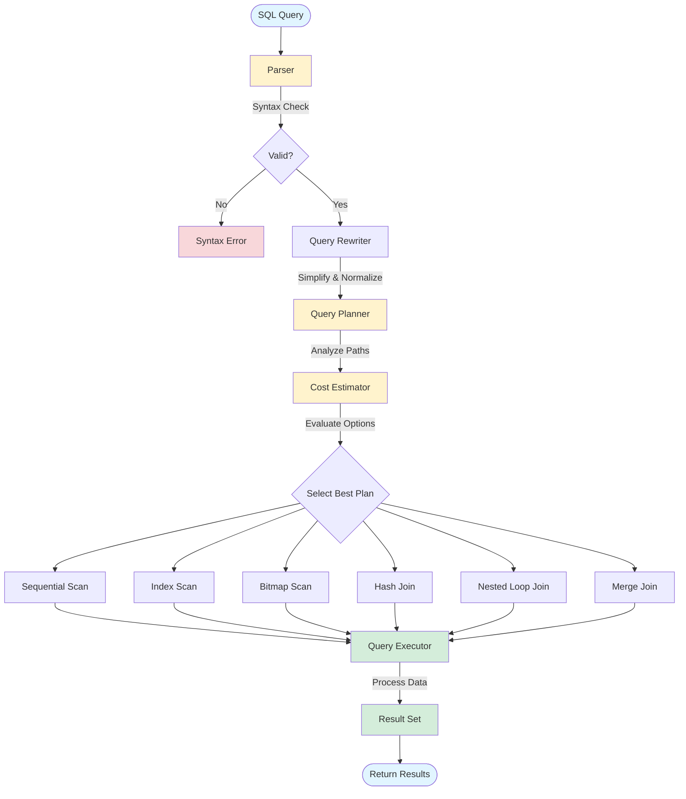

# SQL Query Execution Flow

## Execution Phases

### 1. Parsing
- **Input**: Raw SQL text
- **Process**: Lexical analysis, syntax validation
- **Output**: Parse tree (AST)

### 2. Query Rewriting
- **Input**: Parse tree
- **Process**: View expansion, rule application, simplification
- **Output**: Rewritten query tree

### 3. Planning
- **Input**: Query tree
- **Process**: 
  - Generate possible execution paths
  - Estimate cost for each path (I/O, CPU, memory)
  - Consider indexes, statistics, constraints
- **Output**: Optimal execution plan

### 4. Execution
- **Input**: Execution plan
- **Process**: Execute operators in plan order
- **Output**: Result rows

## Access Methods

| Method | Use Case | Cost |
|--------|----------|------|
| **Sequential Scan** | Small tables, no index available | High for large tables |
| **Index Scan** | Selective queries, ordered results | Low for selective queries |
| **Bitmap Scan** | Medium selectivity, multiple indexes | Medium |
| **Index-Only Scan** | All columns in index | Very low |

## Join Algorithms

| Algorithm | Best For | Memory |
|-----------|----------|--------|
| **Nested Loop** | Small tables, indexed join key | Low |
| **Hash Join** | Large tables, equality join | High |
| **Merge Join** | Sorted inputs, equality join | Medium |
