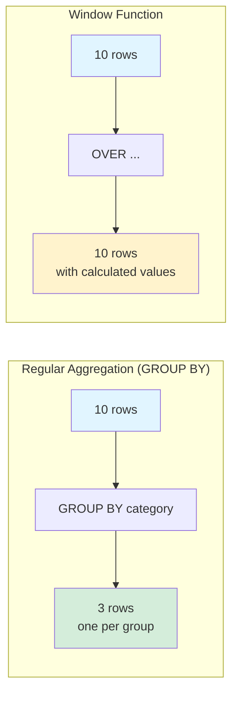
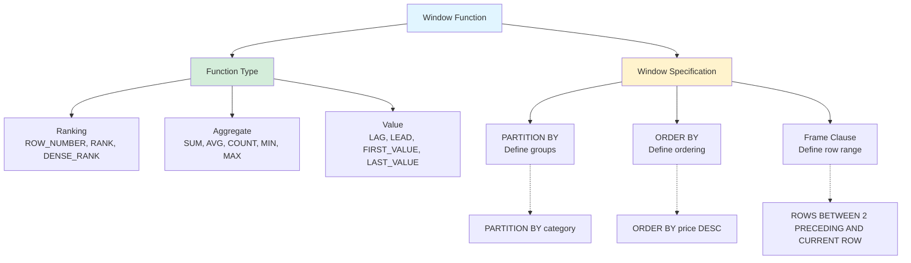
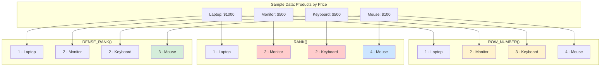
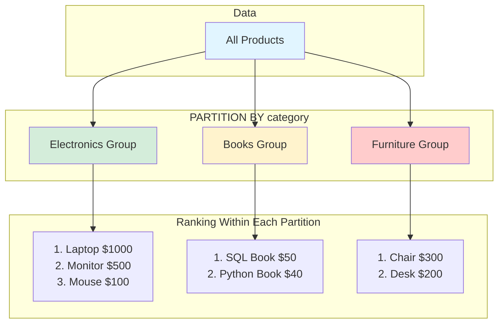
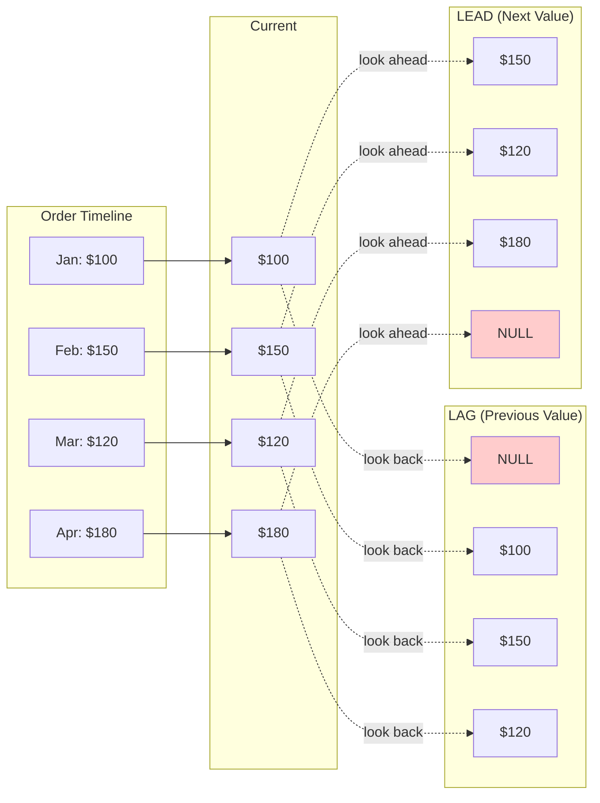
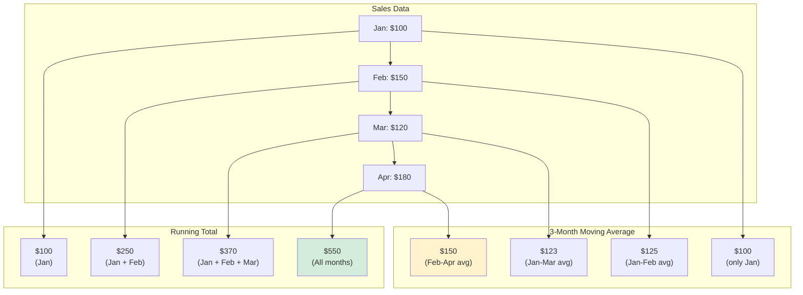
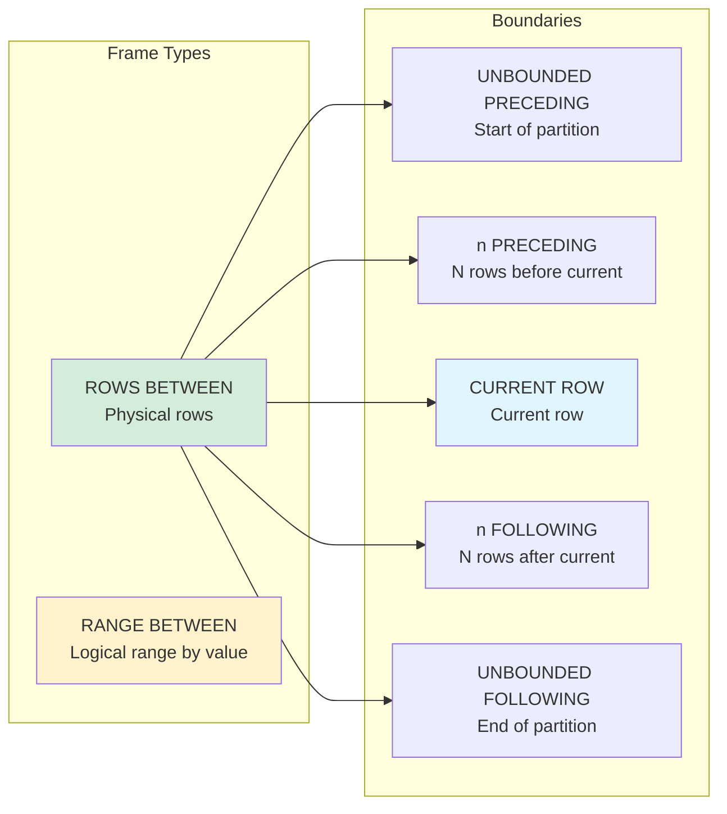

# Window Functions Explained

## Concept Overview



**Key Difference**: 
- **GROUP BY**: Collapses rows into groups
- **Window Functions**: Keep all rows, add calculated columns

---

## Window Function Components



---

## ROW_NUMBER() vs RANK() vs DENSE_RANK()



| Function | Ties? | Gap After Tie? |
|----------|-------|----------------|
| **ROW_NUMBER()** | ❌ No (arbitrary order) | N/A |
| **RANK()** | ✅ Yes (same rank) | ✅ Yes (skip numbers) |
| **DENSE_RANK()** | ✅ Yes (same rank) | ❌ No (consecutive) |

**Example**:
```sql
SELECT 
    product_name,
    price,
    ROW_NUMBER() OVER (ORDER BY price DESC) AS row_num,
    RANK() OVER (ORDER BY price DESC) AS rank,
    DENSE_RANK() OVER (ORDER BY price DESC) AS dense_rank
FROM products;
```

---

## PARTITION BY Visualization



**Without PARTITION BY**: Ranks globally across all products  
**With PARTITION BY category**: Ranks reset within each category

```sql
-- Global ranking
SELECT 
    product_name,
    category,
    price,
    ROW_NUMBER() OVER (ORDER BY price DESC) AS global_rank
FROM products;

-- Ranking per category
SELECT 
    product_name,
    category,
    price,
    ROW_NUMBER() OVER (PARTITION BY category ORDER BY price DESC) AS category_rank
FROM products;
```

---

## LAG() and LEAD() Flow



**Use Cases**:
- **LAG**: Compare with previous period (month-over-month growth)
- **LEAD**: Compare with next period (predict trends)

```sql
SELECT 
    order_date,
    total_amount,
    LAG(total_amount) OVER (ORDER BY order_date) AS prev_order,
    total_amount - LAG(total_amount) OVER (ORDER BY order_date) AS change_from_prev,
    LEAD(total_amount) OVER (ORDER BY order_date) AS next_order
FROM orders;
```

---

## Running Total with Frame



```sql
-- Running total
SELECT 
    month,
    sales,
    SUM(sales) OVER (ORDER BY month) AS running_total
FROM monthly_sales;

-- 3-month moving average
SELECT 
    month,
    sales,
    AVG(sales) OVER (
        ORDER BY month 
        ROWS BETWEEN 2 PRECEDING AND CURRENT ROW
    ) AS moving_avg_3m
FROM monthly_sales;
```

---

## Frame Specifications



**Common Frames**:
```sql
-- All rows up to current (running total)
ROWS BETWEEN UNBOUNDED PRECEDING AND CURRENT ROW

-- 3 rows centered window
ROWS BETWEEN 1 PRECEDING AND 1 FOLLOWING

-- All rows in partition
ROWS BETWEEN UNBOUNDED PRECEDING AND UNBOUNDED FOLLOWING
```

---

## Complete Example

```sql
SELECT 
    product_name,
    category,
    price,
    
    -- Ranking functions
    ROW_NUMBER() OVER (PARTITION BY category ORDER BY price DESC) AS row_num,
    RANK() OVER (PARTITION BY category ORDER BY price DESC) AS rank,
    DENSE_RANK() OVER (PARTITION BY category ORDER BY price DESC) AS dense_rank,
    
    -- Analytical functions
    LAG(price) OVER (PARTITION BY category ORDER BY price DESC) AS more_expensive,
    LEAD(price) OVER (PARTITION BY category ORDER BY price DESC) AS less_expensive,
    
    -- Aggregate as window function
    AVG(price) OVER (PARTITION BY category) AS avg_category_price,
    price - AVG(price) OVER (PARTITION BY category) AS diff_from_avg,
    
    -- First and last
    FIRST_VALUE(product_name) OVER (PARTITION BY category ORDER BY price DESC) AS most_expensive,
    LAST_VALUE(product_name) OVER (
        PARTITION BY category 
        ORDER BY price DESC
        ROWS BETWEEN UNBOUNDED PRECEDING AND UNBOUNDED FOLLOWING
    ) AS least_expensive
    
FROM products
ORDER BY category, price DESC;
```
