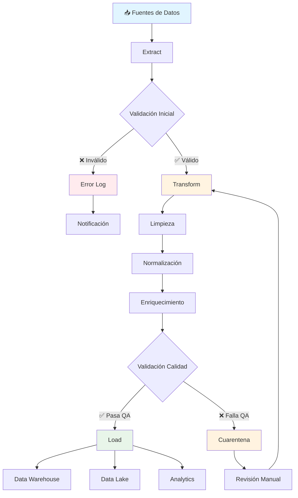
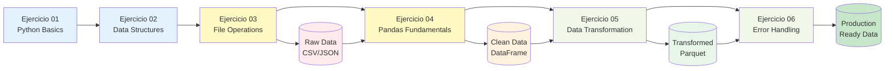
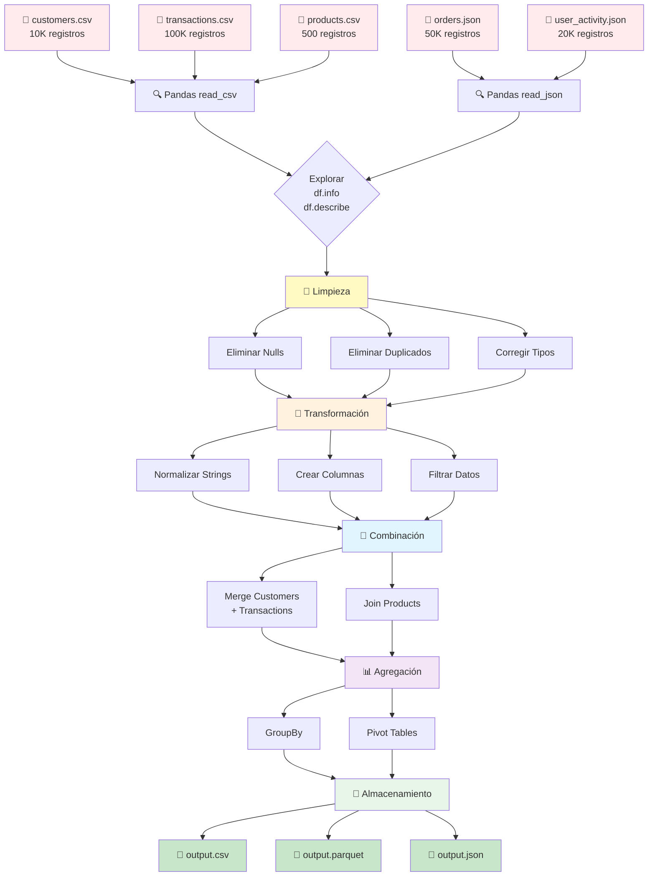
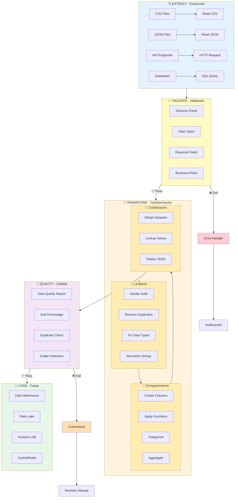
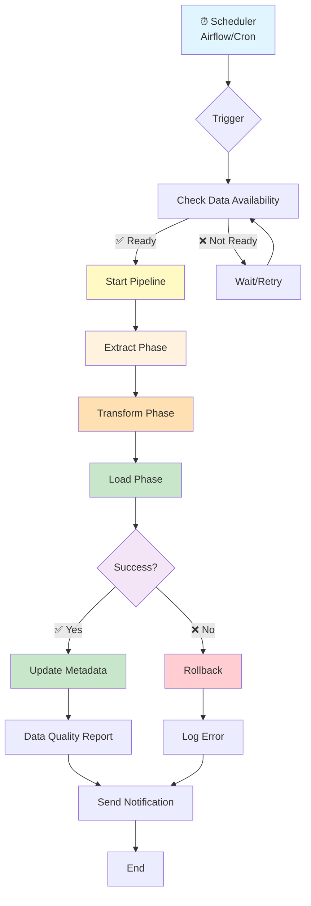
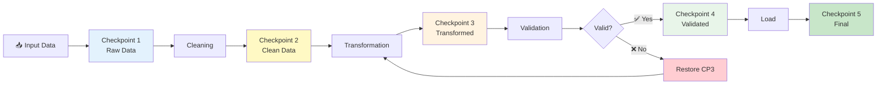
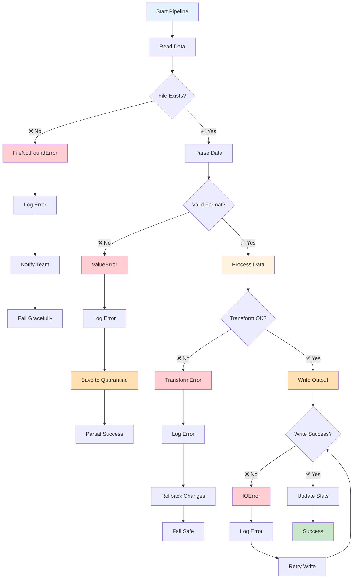
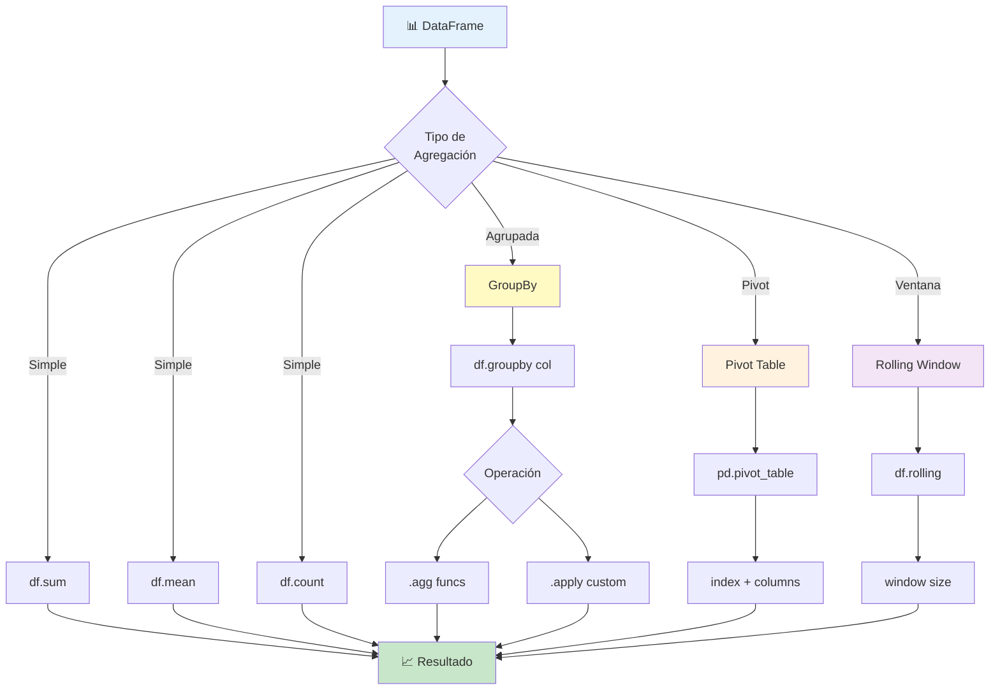

# 🔄 Data Flow - Flujos de Datos y Pipelines ETL

## 📊 Pipeline ETL Completo



## 🎯 Pipeline del Módulo (Ejercicios 01-06)



## 📁 Flujo de Archivos

### De Archivos Crudos a Datos Procesados



## 🔄 Pipeline de Transformación Detallado

### Extract → Transform → Load (ETL)



## 📊 Flujo de Procesamiento Batch



## 🎭 Procesamiento con Checkpoints



## 🔁 Pipeline con Error Handling



## 📈 Flujo de Agregación



## 💡 Mejores Prácticas

### 1. Separación de Responsabilidades
```python
def extract(source):
    """Solo extracción"""
    return pd.read_csv(source)

def transform(df):
    """Solo transformación"""
    df = df.dropna()
    df = df.drop_duplicates()
    return df

def load(df, destination):
    """Solo carga"""
    df.to_parquet(destination)

# Pipeline claro
df = extract('input.csv')
df = transform(df)
load(df, 'output.parquet')
```

### 2. Checkpoints
```python
def pipeline_with_checkpoints(input_file):
    # Checkpoint 1: Raw
    df = pd.read_csv(input_file)
    df.to_parquet('checkpoints/01_raw.parquet')
    
    # Checkpoint 2: Clean
    df = clean(df)
    df.to_parquet('checkpoints/02_clean.parquet')
    
    # Checkpoint 3: Transformed
    df = transform(df)
    df.to_parquet('checkpoints/03_transformed.parquet')
    
    return df
```

### 3. Logging
```python
import logging

logging.basicConfig(level=logging.INFO)
logger = logging.getLogger(__name__)

def process_data(df):
    logger.info(f"Processing {len(df)} records")
    
    initial_count = len(df)
    df = df.dropna()
    logger.info(f"Removed {initial_count - len(df)} null rows")
    
    return df
```

### 4. Validación en Cada Paso
```python
def validate_and_transform(df):
    # Validar antes
    assert len(df) > 0, "DataFrame vacío"
    assert 'id' in df.columns, "Columna 'id' faltante"
    
    # Transformar
    df = transform(df)
    
    # Validar después
    assert df['id'].nunique() == len(df), "IDs duplicados"
    assert df['precio'].min() >= 0, "Precios negativos"
    
    return df
```

---

**Siguiente**: Ver [pandas-operations.md](pandas-operations.md) para operaciones detalladas
