# Step Functions - Patrones de Orquestación

## Patrones Comunes de Step Functions

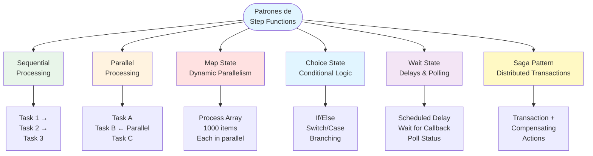

## Sequential Processing Pattern

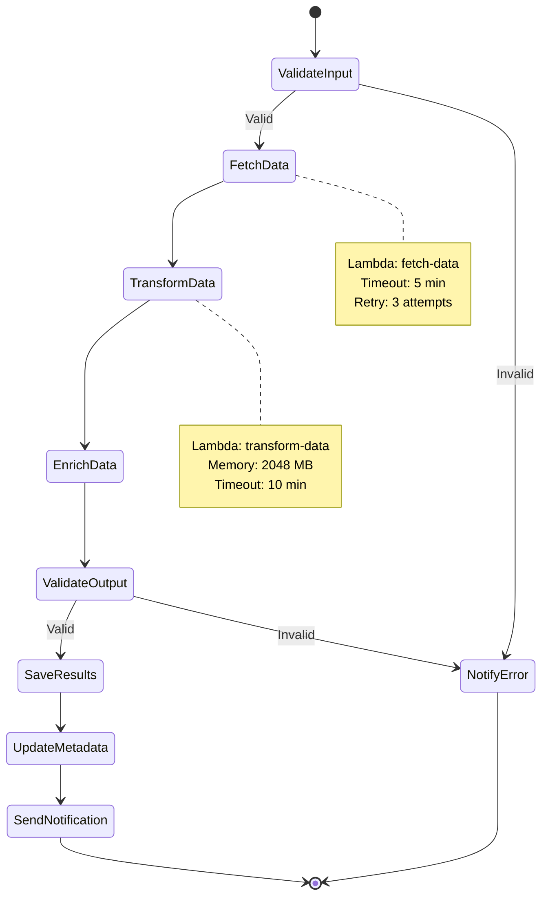

## Parallel Processing Pattern

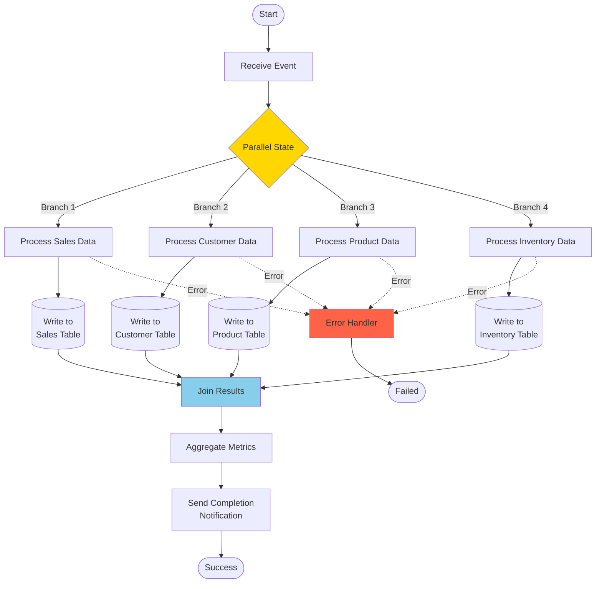

## Map State Pattern - Dynamic Parallelism

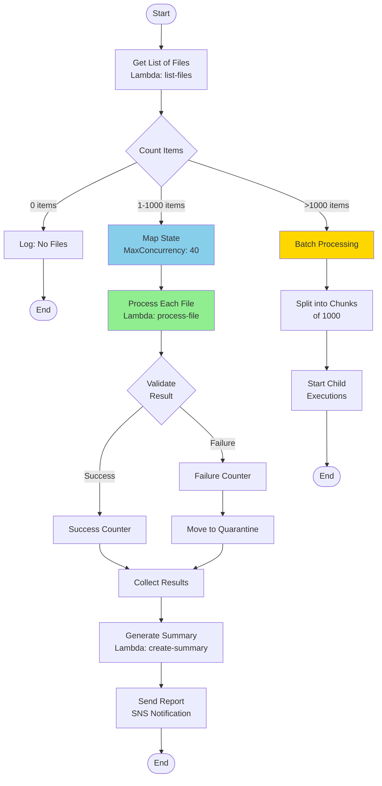

## Choice State Pattern - Conditional Logic

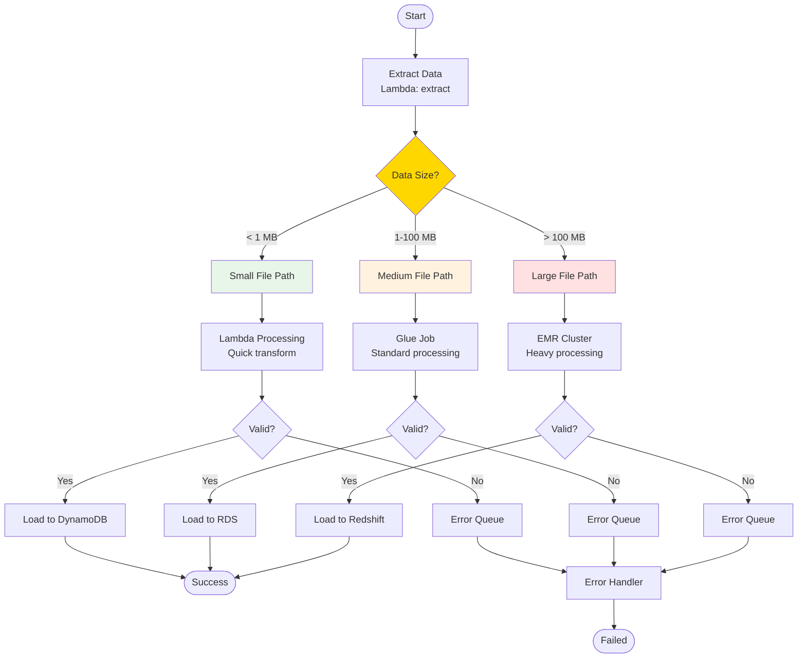

## Wait State Pattern - Delays & Callbacks

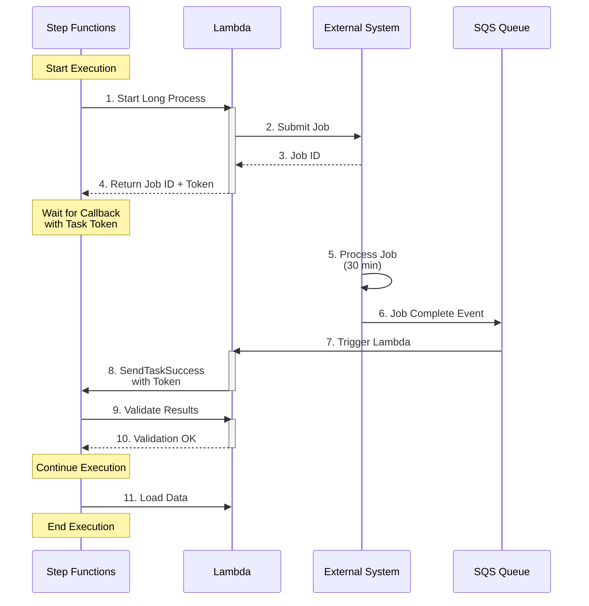

## Saga Pattern - Distributed Transactions

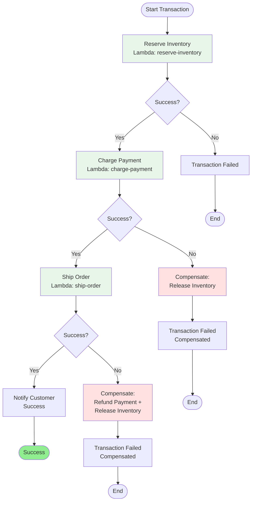

## Error Handling & Retry Pattern

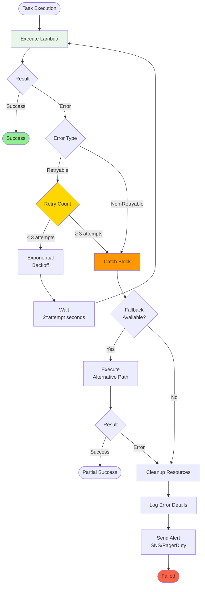

## Cost Optimization Pattern

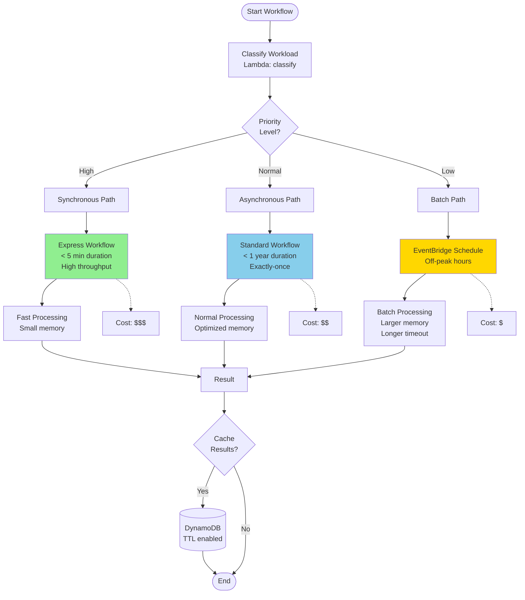

## Human Approval Pattern

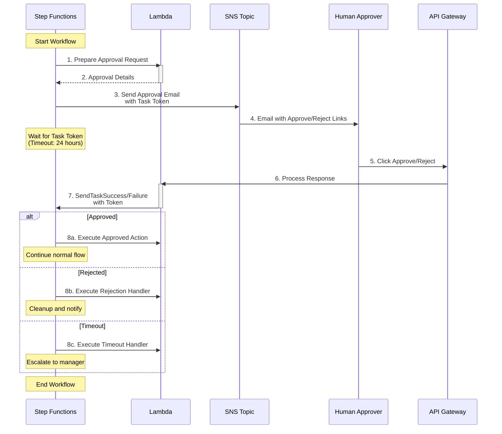

## Comparison: Express vs Standard Workflows

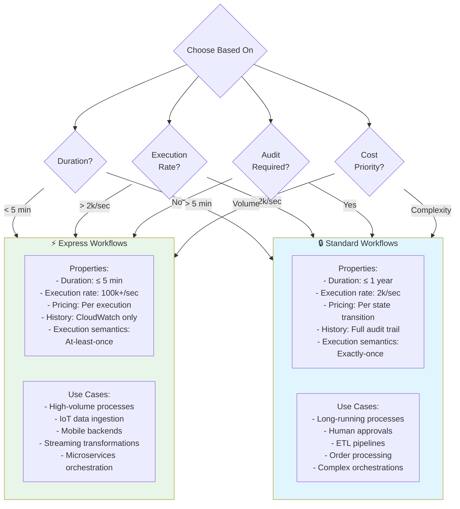

## Uso

Estos diagramas muestran:
1. Patrones comunes de orquestación con Step Functions
2. Sequential processing para workflows lineales
3. Parallel processing para tareas independientes
4. Map state para procesamiento dinámico de arrays
5. Choice state para lógica condicional
6. Wait state y callbacks para procesos asíncronos
7. Saga pattern para transacciones distribuidas
8. Manejo de errores y reintentos
9. Optimización de costos según prioridad
10. Human approval pattern con task tokens
11. Comparación Express vs Standard workflows

Para más información, consulta la [documentación de AWS Step Functions](https://docs.aws.amazon.com/step-functions/).
