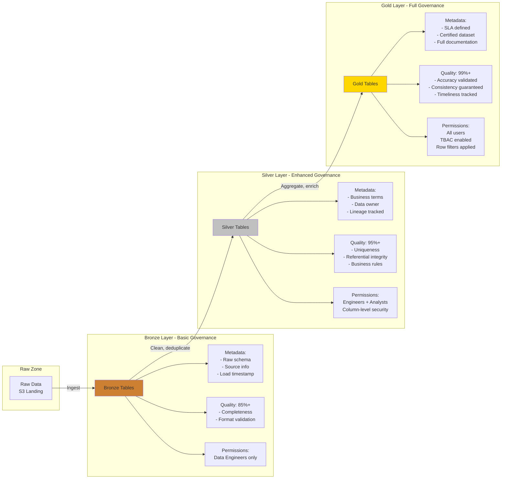
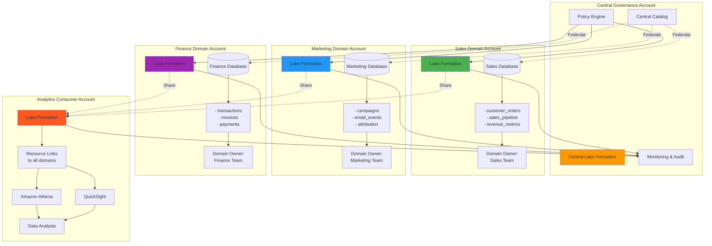
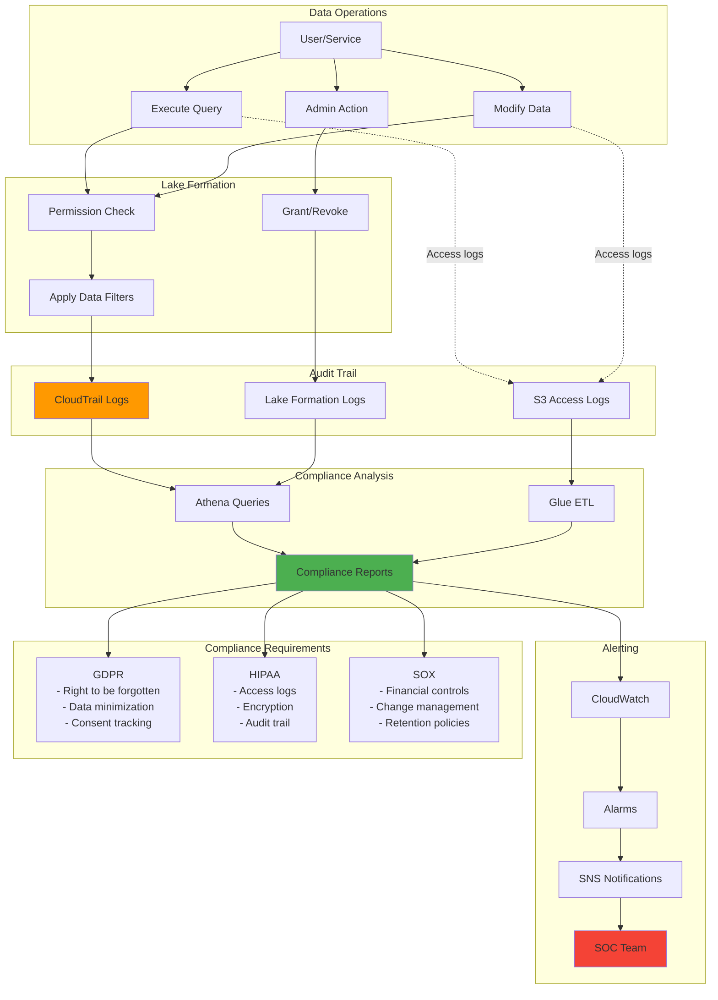
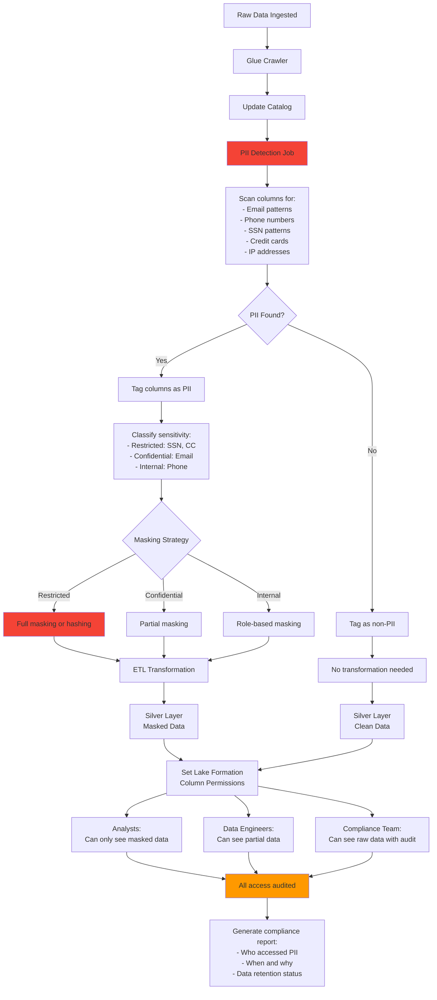
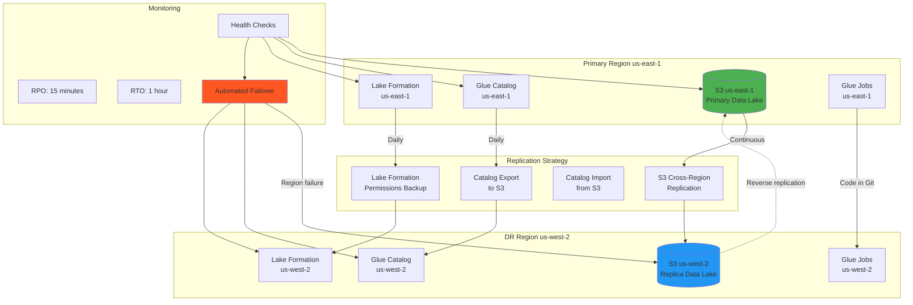
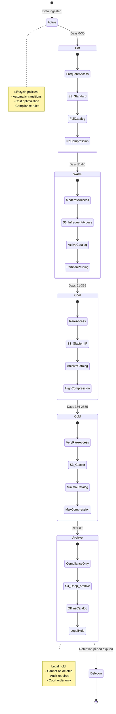
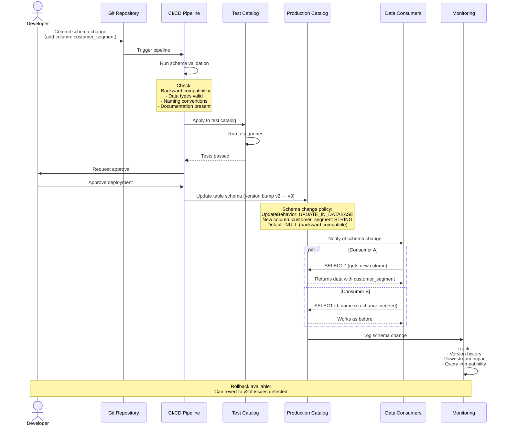
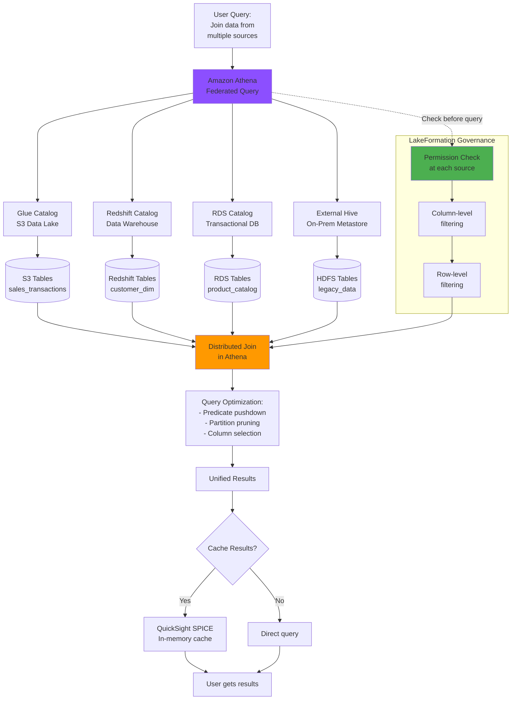
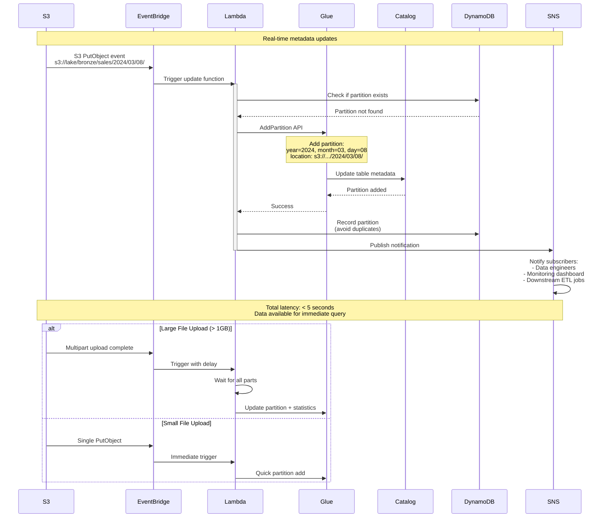
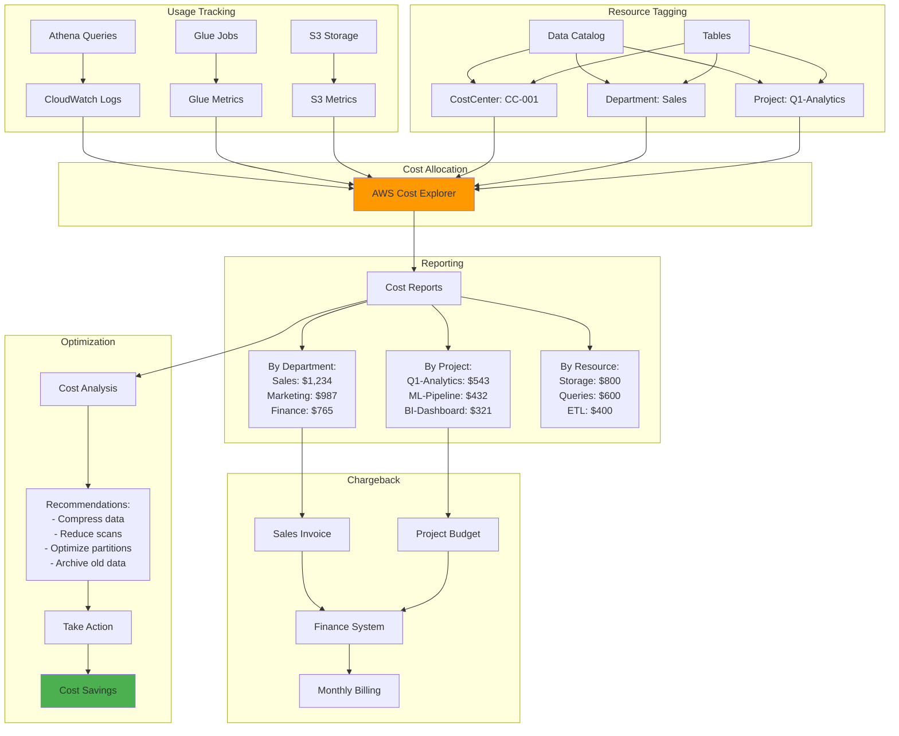

# Data Catalog & Governance Pattern Diagrams

## 1. Bronze-Silver-Gold with Governance

## 2. Multi-Account Data Mesh Architecture

## 3. Compliance and Audit Pattern

## 4. PII Detection and Masking Pattern

## 5. Disaster Recovery Pattern

## 6. Data Retention and Archival Pattern

## 7. Schema Evolution Pattern

## 8. Federated Query Pattern

## 9. Real-Time Catalog Updates Pattern

## 10. Cost Allocation and Chargeback Pattern

## Usage

These pattern diagrams demonstrate advanced Data Catalog and Governance architectures:

1. **Bronze-Silver-Gold**: Governance evolution across layers
2. **Data Mesh**: Multi-account domain-driven architecture
3. **Compliance**: Audit trail and regulatory compliance
4. **PII Detection**: Automated sensitive data handling
5. **Disaster Recovery**: Cross-region resilience
6. **Data Retention**: Lifecycle management and archival
7. **Schema Evolution**: Safe schema changes with versioning
8. **Federated Query**: Query across multiple catalogs
9. **Real-Time Updates**: Event-driven catalog updates
10. **Cost Allocation**: Usage tracking and chargeback
