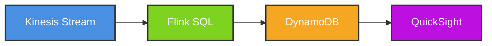

# Architecture Diagrams - Module 15: Real-Time Analytics

This directory contains Mermaid diagrams illustrating real-time analytics patterns with AWS Kinesis and Apache Flink.

## Diagrams

### 1. Kinesis Analytics Architecture
**File**: [kinesis-analytics-architecture.mmd](kinesis-analytics-architecture.mmd)

Shows complete real-time analytics pipeline:
- **Ingestion**: Kinesis Data Streams (shards, partitions)
- **Processing**: Kinesis Data Analytics for Apache Flink
- **Output**: Multiple sinks (S3, Redshift, Elasticsearch, DynamoDB)

**Use Cases**:
- Real-time metrics aggregation
- Log analytics
- IoT sensor data processing

**Example**: Processing 100K events/sec with sub-second latency

---

### 2. Flink Windowing Strategies
**File**: [flink-windowing.mmd](flink-windowing.mmd)

Shows 3 window types:
- **Tumbling Windows**: Fixed-size, non-overlapping (5-minute intervals)
- **Sliding Windows**: Overlapping (10-minute window, 5-minute slide)
- **Session Windows**: Dynamic, inactivity-based (30-minute gap)

**Use Cases**:
- Page view counts per 5 minutes
- Moving averages (1-hour sliding window)
- User session analytics

**Example**: E-commerce checkout abandonment detection

---

### 3. Complex Event Processing (CEP)
**File**: [complex-event-processing.mmd](complex-event-processing.mmd)

Shows pattern detection with Flink CEP:
- **Pattern**: Login → HighValuePurchase → Logout (within 10 minutes)
- **MATCH_RECOGNIZE** SQL syntax
- **Alerting**: Fraud detection, anomaly detection

**Use Cases**:
- Fraud detection (impossible travel, velocity checks)
- Security monitoring (brute force attacks)
- Customer journey analysis

**Example**: Detect account takeover by analyzing login patterns

---

### 4. Real-Time ML Scoring
**File**: [real-time-ml-scoring.mmd](real-time-ml-scoring.mmd)

Shows ML inference pipeline:
- **Stream**: Kinesis events → Flink
- **Feature Engineering**: Real-time feature extraction
- **Scoring**: SageMaker endpoint invocation (<100ms)
- **Action**: Write results to DynamoDB

**Use Cases**:
- Fraud scoring (credit card transactions)
- Product recommendations (personalized)
- Predictive maintenance (IoT sensors)

**Example**: Score credit card transactions with <50ms latency

---

### 5. Streaming Aggregations
**File**: [streaming-aggregations.mmd](streaming-aggregations.mmd)

Shows aggregation patterns:
- **Count**: Events per minute
- **Sum**: Revenue per product
- **Average**: Response time sliding average
- **Top-N**: Popular products (last hour)

**Use Cases**:
- Real-time dashboards
- KPI monitoring
- Leaderboards

**Example**: Live sports statistics dashboard

---

### 6. Real-Time Dashboard Pipeline
**File**: [real-time-dashboard-pipeline.mmd](real-time-dashboard-pipeline.mmd)

Shows end-to-end dashboard architecture:
- **Ingestion**: Kinesis Data Streams
- **Processing**: Flink SQL aggregations
- **Storage**: ElastiCache + Redshift
- **Visualization**: QuickSight + CloudWatch
- **Refresh**: Sub-second updates

**Use Cases**:
- Executive dashboards
- NOC monitoring screens
- Live metrics

**Example**: Real-time sales dashboard for Black Friday

---

## How to Use Diagrams

### Rendering Mermaid

**VS Code** (with Mermaid extension):
```bash
# Install extension
code --install-extension bierner.markdown-mermaid

# Open diagram file
code kinesis-analytics-architecture.mmd
```

**Online**:
- [Mermaid Live Editor](https://mermaid.live/)
- Copy/paste diagram content

### Exporting to Image

**Using Mermaid CLI**:
```bash
# Install
npm install -g @mermaid-js/mermaid-cli

# Export to PNG
mmdc -i kinesis-analytics-architecture.mmd -o kinesis-analytics-architecture.png

# Export all diagrams
for f in *.mmd; do mmdc -i "$f" -o "${f%.mmd}.png"; done
```

---

## Exercise Mapping

| Exercise | Diagrams |
|----------|----------|
| Exercise 01 (Kinesis Analytics SQL) | kinesis-analytics-architecture, flink-windowing |
| Exercise 02 (Flink Table API) | streaming-aggregations, flink-windowing |
| Exercise 03 (Real-Time Dashboards) | real-time-dashboard-pipeline |
| Exercise 04 (CEP Fraud Detection) | complex-event-processing |
| Exercise 05 (ML Scoring) | real-time-ml-scoring |

---

## Pattern Flow

```
Kinesis Data Streams (Ingestion)
    ↓
Kinesis Data Analytics (Flink Processing)
    ↓ (windowing)
Tumbling/Sliding/Session Windows
    ↓ (aggregation)
Streaming Metrics
    ↓ (pattern detection - optional)
Complex Event Processing (CEP)
    ↓ (ML scoring - optional)
SageMaker Real-Time Inference
    ↓
Output Sinks (S3, DynamoDB, Redshift)
    ↓
QuickSight Dashboards
```

---

## Customization

All diagrams use consistent styling:
- **Blue**: Data sources/ingestion
- **Green**: Processing/transformation
- **Orange**: Storage/sinks
- **Purple**: Visualization/dashboards
- **Red**: Alerts/anomalies

Example:


---

## Resources

### Flink Documentation
- [Apache Flink Docs](https://nightlies.apache.org/flink/flink-docs-stable/)
- [Flink SQL](https://nightlies.apache.org/flink/flink-docs-stable/docs/dev/table/sql/)
- [Flink CEP](https://nightlies.apache.org/flink/flink-docs-stable/docs/libs/cep/)

### AWS Documentation
- [Kinesis Data Analytics](https://docs.aws.amazon.com/kinesisanalytics/)
- [Flink on AWS](https://aws.amazon.com/blogs/big-data/category/analytics/amazon-kinesis-data-analytics/)

### Real-World Examples
- **Netflix**: Real-time viewing metrics (Keystone)
- **Uber**: Surge pricing analytics
- **Airbnb**: Fraud detection with Flink CEP

---

## Notes

- All diagrams show production-ready architectures
- Cost estimates included in some diagrams
- Latency targets: <1s for aggregations, <100ms for ML scoring
- Scalability: 100K-1M events/sec
- Diagrams complement exercise code
