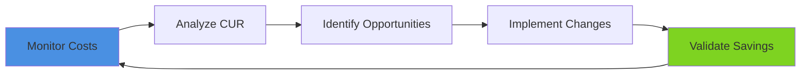

# Module 17: Cost Optimization - Architecture Diagrams

This directory contains comprehensive Mermaid diagrams illustrating AWS cost optimization patterns, FinOps workflows, and cost-aware architectures for data engineering.

## 📊 Diagram Index

### 1. Cost Analysis Pipeline (`cost-analysis-pipeline.mmd`)
**Focus**: Cost Explorer API, Cost and Usage Reports (CUR), cost dashboards  
**Exercise**: Exercise 01 - Cost Analysis with Cost Explorer & CUR  
**Key Components**:
- Cost and Usage Report (CUR) setup with S3 export
- Athena queries for cost analysis
- QuickSight cost dashboards
- Cost allocation tags and dimension filters
- Cost anomaly detection queries

### 2. S3 Storage Lifecycle Optimization (`s3-lifecycle-optimization.mmd`)
**Focus**: S3 storage classes, lifecycle policies, Intelligent-Tiering  
**Exercise**: Exercise 02 - S3 Storage Cost Optimization  
**Key Components**:
- Storage class comparison (Standard, IA, Glacier, Deep Archive)
- Lifecycle transition rules
- S3 Intelligent-Tiering automation
- S3 Storage Lens analytics
- Cost savings calculations

### 3. Reserved Instances & Savings Plans (`ri-savings-plans-comparison.mmd`)
**Focus**: Compute purchasing options decision matrix  
**Exercise**: Exercise 03 - Compute Purchasing Options  
**Key Components**:
- Reserved Instances (Standard, Convertible)
- Savings Plans (Compute, EC2, SageMaker)
- On-Demand baseline comparison
- Spot Instances for fault-tolerant workloads
- ROI calculator and decision tree

### 4. Right-Sizing Workflow (`right-sizing-workflow.mmd`)
**Focus**: AWS Compute Optimizer, CloudWatch metrics, auto-scaling  
**Exercise**: Exercise 04 - Right-Sizing and Auto Scaling  
**Key Components**:
- CloudWatch metrics collection (CPU, Memory, Network)
- AWS Compute Optimizer recommendations
- Right-sizing decision workflow
- EC2 Auto Scaling policies
- RDS and Redshift resize strategies

### 5. Serverless Cost Comparison (`serverless-cost-comparison.mmd`)
**Focus**: Lambda/Fargate vs EC2/ECS cost models  
**Exercise**: Exercise 05 - Serverless vs Traditional Cost Analysis  
**Key Components**:
- Lambda pricing (requests + duration + memory)
- Fargate vs EC2 for containers
- Athena vs EMR for analytics
- Step Functions vs EC2 orchestration
- TCO breakeven calculations

### 6. Cost Governance Automation (`cost-governance-automation.mmd`)
**Focus**: AWS Budgets, anomaly detection, automated resource cleanup  
**Exercise**: Exercise 06 - Automated Cost Governance  
**Key Components**:
- AWS Budgets with SNS alerts
- Cost Anomaly Detection ML
- Automated tagging with Config rules
- Lambda functions for resource cleanup (idle instances, unattached volumes)
- FinOps dashboard with KPIs

## 🎯 Diagram Usage Patterns

### Cost Optimization Flow
```
1. Visibility → cost-analysis-pipeline.mmd
   ↓ Analyze spending patterns, identify top cost drivers
2. Storage Optimization → s3-lifecycle-optimization.mmd
   ↓ Reduce storage costs (typically 30-70%)
3. Compute Optimization → ri-savings-plans-comparison.mmd
   ↓ Commit to RIs/SPs for steady workloads (save 40-72%)
4. Right-Sizing → right-sizing-workflow.mmd
   ↓ Match capacity to demand (save 20-50%)
5. Architecture Modernization → serverless-cost-comparison.mmd
   ↓ Serverless for variable loads (pay-per-use)
6. Governance → cost-governance-automation.mmd
   ↓ Prevent cost drift with automated controls
```

### FinOps Lifecycle Mapping
- **Inform Phase**: cost-analysis-pipeline.mmd (visibility into spending)
- **Optimize Phase**: s3-lifecycle, ri-savings-plans, right-sizing, serverless-cost
- **Operate Phase**: cost-governance-automation (continuous optimization)

## 🔧 Rendering Diagrams

### VS Code (Recommended)
1. Install [Mermaid Preview Extension](https://marketplace.visualstudio.com/items?itemName=bierner.markdown-mermaid)
2. Open any `.mmd` file
3. Right-click → "Open Preview" (or `Ctrl+Shift+V`)

### Mermaid Live Editor
- Visit https://mermaid.live
- Paste diagram code
- Export as PNG/SVG

### Command-Line (mermaid-cli)
```bash
# Install mermaid-cli
npm install -g @mermaid-js/mermaid-cli

# Render single diagram
mmdc -i cost-analysis-pipeline.mmd -o cost-analysis-pipeline.png -t dark -b transparent

# Render all diagrams
for file in *.mmd; do
  mmdc -i "$file" -o "${file%.mmd}.png" -t dark -b transparent
done
```

### Include in Documentation
```markdown
# Cost Analysis Architecture

```

## 💡 Customization Tips

### Update Cost Values
All diagrams include sample cost calculations. Update these with your actual AWS pricing:
```mermaid
%% Example: Update S3 costs in s3-lifecycle-optimization.mmd
Standard[$0.023/GB] --> IntelligentTiering[$0.0125/GB Frequent + $0.01/GB Infrequent]
```

### Modify Thresholds
Adjust cost thresholds and alert values:
```mermaid
%% Example: Change budget alert in cost-governance-automation.mmd
Budget["Monthly Budget: $50,000"] --> Alert["Alert at 80%: $40,000"]
```

### Add Custom Services
Extend diagrams with additional AWS services:
```mermaid
%% Add your custom service
CustomService[Your Service] --> CostAllocation[Cost Allocation Tags]
```

## 📚 Real-World Cost Optimization Examples

### Netflix
- **Strategy**: Spot Instances + RIs + serverless
- **Result**: 90% Spot utilization for batch processing, $100M+ annual savings
- **Diagram**: `serverless-cost-comparison.mmd`

### Airbnb
- **Strategy**: S3 lifecycle + Intelligent-Tiering + data lake optimization
- **Result**: 72% reduction in storage costs ($8M → $2.2M annually)
- **Diagram**: `s3-lifecycle-optimization.mmd`

### Capital One
- **Strategy**: FinOps culture + automated governance + chargeback model
- **Result**: 40% reduction in cloud spend, $30M annual savings
- **Diagram**: `cost-governance-automation.mmd`

## 🔍 Cost Optimization Patterns

### Pattern 1: Tiered Storage with Lifecycle
**Problem**: Large data lakes with high storage costs  
**Solution**: Implement S3 lifecycle policies (Standard → IA → Glacier)  
**Diagram**: `s3-lifecycle-optimization.mmd`  
**Expected Savings**: 50-70%

### Pattern 2: Reserved Capacity for Stable Workloads
**Problem**: Continuous production workloads on On-Demand pricing  
**Solution**: Purchase RIs or Savings Plans for predictable usage  
**Diagram**: `ri-savings-plans-comparison.mmd`  
**Expected Savings**: 40-72%

### Pattern 3: Serverless for Variable Workloads
**Problem**: Over-provisioned EC2 instances for bursty workloads  
**Solution**: Migrate to Lambda/Fargate for true pay-per-use  
**Diagram**: `serverless-cost-comparison.mmd`  
**Expected Savings**: 30-80% (workload-dependent)

### Pattern 4: Automated Resource Cleanup
**Problem**: Orphaned resources (idle instances, snapshots, unattached volumes)  
**Solution**: Lambda functions + CloudWatch Events for automated cleanup  
**Diagram**: `cost-governance-automation.mmd`  
**Expected Savings**: 15-25%

## 🏷️ Cost Allocation Tagging Strategy

All diagrams include cost allocation tags. Recommended tag schema:

| Tag Key | Tag Value | Purpose |
|---------|----------|---------|
| `CostCenter` | `data-engineering`, `analytics`, `ml` | Chargeback |
| `Project` | `customer-360`, `fraud-detection` | Budget tracking |
| `Environment` | `prod`, `dev`, `test` | Cost segregation |
| `Owner` | `john.doe@company.com` | Accountability |
| `Application` | `etl-pipeline`, `data-warehouse` | Service mapping |

## 🔄 Continuous Optimization Workflow



1. **Weekly**: Review cost anomalies, check budget alerts
2. **Monthly**: Analyze CUR, RI/SP utilization, right-sizing opportunities
3. **Quarterly**: TCO comparison, architecture review, FinOps reporting

---

**Maintained by**: Module 17 - Cost Optimization  
**Last Updated**: January 2025  
**Mermaid Version**: 10.6+
