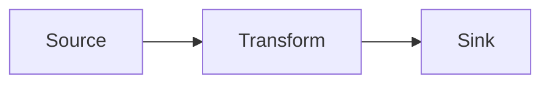
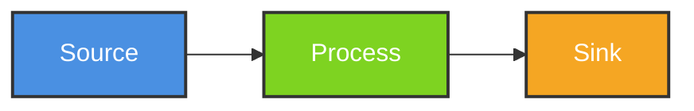

# Architecture Diagrams - Module 18: Advanced Architectures

This directory contains Mermaid diagrams illustrating advanced data architecture patterns.

## Diagrams

### 1. Lambda Architecture
**File**: [lambda-architecture.mmd](lambda-architecture.mmd)

Shows the classic Lambda Architecture with:
- **Batch Layer**: Historical data processing (Spark, Hive)
- **Speed Layer**: Real-time stream processing (Kinesis, Lambda)
- **Serving Layer**: Combined views (DynamoDB, Redshift)

**Use Cases**:
- High-volume event processing with both batch and real-time
- Historical re-processing requirements
- Complex analytics combining batch and streaming

**Example**: Netflix recommendations (batch model training + real-time scoring)

---

### 2. Kappa Architecture
**File**: [kappa-architecture.mmd](kappa-architecture.mmd)

Shows stream-only architecture with:
- Single stream processing path (no batch layer)
- Replayable log (Kafka with 365-day retention)
- Multiple consumers reading at different speeds

**Use Cases**:
- Pure streaming systems
- Event-driven architectures
- Systems where batch = replay of stream

**Example**: Uber real-time surge pricing

---

### 3. Data Mesh Topology
**File**: [data-mesh-topology.mmd](data-mesh-topology.mmd)

Shows domain-oriented data architecture:
- **Domain Teams**: Product, Sales, Customer (autonomous)
- **Data Products**: Self-serve APIs with SLAs
- **Federated Governance**: Central schema registry + catalog
- **Self-serve Infrastructure**: Platform team provides tools

**Use Cases**:
- Large organizations with multiple data teams
- Distributed data ownership
- Scaling data beyond centralized teams

**Example**: Airbnb's data mesh for host/guest/booking domains

---

### 4. CQRS + Event Sourcing
**File**: [cqrs-event-sourcing.mmd](cqrs-event-sourcing.mmd)

Shows Command Query Responsibility Segregation:
- **Command Side**: Write operations to Event Store (DynamoDB)
- **Event Bus**: EventBridge for decoupling
- **Query Side**: Multiple read models (ElastiCache, Redshift, Elasticsearch)

**Use Cases**:
- High read/write scalability requirements
- Multiple query patterns for same data
- Audit trail and temporal queries

**Example**: E-commerce order management

---

### 5. Event Sourcing Flow
**File**: [event-sourcing-flow.mmd](event-sourcing-flow.mmd)

Shows event log with snapshots:
- Immutable event log (append-only)
- Event replay for state reconstruction
- Snapshots for performance optimization
- Temporal queries (state at any point in time)

**Use Cases**:
- Financial systems requiring audit trails
- Systems needing time travel debugging
- Applications with complex state machines

**Example**: Banking transaction ledger

---

### 6. Architecture Comparison
**File**: [architecture-comparison.mmd](architecture-comparison.mmd)

Decision matrix comparing:
- **Lambda**: Batch + Speed layers
- **Kappa**: Stream-only
- **Data Mesh**: Domain-oriented
- **CQRS**: Command/Query separation

**Factors**: Complexity, latency, scalability, consistency

**Use Cases**:
- Choosing architecture for new projects
- Understanding trade-offs

---

### 7. Saga Pattern
**File**: [saga-pattern.mmd](saga-pattern.mmd)

Shows distributed transaction pattern:
- Choreography-based saga (event-driven)
- Compensating transactions for rollback
- Order placement → Payment → Shipment flow

**Use Cases**:
- Microservices transactions
- Cross-service data consistency
- Systems without 2PC/XA transactions

**Example**: E-commerce checkout spanning Order/Payment/Inventory services

---

### 8. Polyglot Persistence
**File**: [polyglot-persistence.mmd](polyglot-persistence.mmd)

Shows multiple database types:
- **DynamoDB**: Event store (NoSQL key-value)
- **Redshift**: Analytics (columnar OLAP)
- **ElastiCache**: Read models (in-memory cache)
- **Elasticsearch**: Search index
- **S3**: Data lake (object storage)

**Use Cases**:
- Different query patterns require different databases
- Optimizing for read/write patterns
- Scaling specific workloads independently

**Example**: LinkedIn using multiple stores for connections, feed, search

---

## How to Use Diagrams

### Rendering Mermaid

**VS Code** (with Mermaid extension):
```bash
# Install extension
code --install-extension bierner.markdown-mermaid

# Open diagram file
code data-mesh-topology.mmd
```

**Online**:
- [Mermaid Live Editor](https://mermaid.live/)
- Copy/paste diagram content

**Documentation**:
```markdown
# In Markdown files

```

### Exporting to Image

**Using Mermaid CLI**:
```bash
# Install
npm install -g @mermaid-js/mermaid-cli

# Export to PNG
mmdc -i lambda-architecture.mmd -o lambda-architecture.png

# Export to SVG
mmdc -i kappa-architecture.mmd -o kappa-architecture.svg
```

---

## Diagram Relationships

### Exercise Mapping

| Exercise | Diagrams |
|----------|----------|
| Exercise 01 (Lambda) | lambda-architecture, polyglot-persistence |
| Exercise 02 (Kappa) | kappa-architecture |
| Exercise 03 (Data Mesh) | data-mesh-topology |
| Exercise 04 (CQRS) | cqrs-event-sourcing, event-sourcing-flow, saga-pattern |

### Architecture Patterns Flow

```
Lambda Architecture
    ↓ (simplify to stream-only)
Kappa Architecture
    ↓ (scale across domains)
Data Mesh
    ↓ (add read/write separation)
CQRS + Event Sourcing
```

---

## Customization

### Adding New Diagrams

1. Create `.mmd` file with Mermaid syntax
2. Test in [Mermaid Live Editor](https://mermaid.live/)
3. Add to this README with description
4. Link from exercise README

### Styling

All diagrams use consistent styling:
- **Blue**: Data sources
- **Green**: Processing layers
- **Orange**: Serving/output layers
- **Red**: Error/compensation paths
- **Purple**: Governance/cross-cutting

Example:


---

## Resources

### Mermaid Documentation
- [Official Docs](https://mermaid-js.github.io/mermaid/)
- [Flow Chart Syntax](https://mermaid-js.github.io/mermaid/#/flowchart)
- [Sequence Diagrams](https://mermaid-js.github.io/mermaid/#/sequenceDiagram)

### Architecture Patterns
- **Lambda**: Nathan Marz, "Big Data" (2015)
- **Kappa**: Jay Kreps, "Questioning the Lambda Architecture" (2014)
- **Data Mesh**: Zhamak Dehghani, "Data Mesh" (2022)
- **CQRS**: Greg Young, "CQRS Documents" (2010)
- **Event Sourcing**: Martin Fowler, "Event Sourcing" (2005)

---

## Notes

- All diagrams are version-controlled (text-based)
- No binary image files in Git (regenerate from `.mmd`)
- Diagrams complement exercise code (not standalone)
- Update diagrams when architecture changes
- Use descriptive node names (avoid abbreviations)
